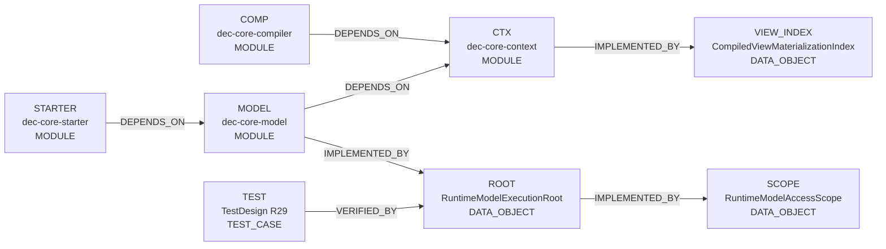

<!-- GENERATED by scripts/render_relationships.py; edit dependency_impact.yaml instead. -->
# 需求关联、影响策略与跨模块实现映射

- Project：`doc-eq-code`
- Version：`V_1.0`
- Revision：`P2-IMPACT-R27`

## 需求—需求关系图

- 本 revision 无适用关系。

## 需求—功能追踪图

- 本 revision 无适用关系。

## 功能—功能影响图



## 关系明细

| ID | From | 类型 | To | 条件 | 理由 | Trace IDs |
|---|---|---|---|---|---|---|
| REL-P2-R27-1 | COMP | DEPENDS_ON | CTX |  | Compiler publishes neutral policy/binding plus the typed materialization index inside one CompiledModelSet aggregate. | TR-P2-005<br>TR-P2-008 |
| REL-P2-R27-2 | CTX | IMPLEMENTED_BY | VIEW_INDEX |  | CompiledModelSet owns the immutable index; EngineContext exposes only a delegated accessor. | TR-P2-005<br>TR-P2-006 |
| REL-P2-R27-3 | MODEL | DEPENDS_ON | CTX |  | MODEL execution root consumes the captured aggregate and typed ModelDataFactory path; no runtime raw-config/default-context reinterpretation. | TR-P2-006<br>TR-P2-009 |
| REL-P2-R27-4 | MODEL | IMPLEMENTED_BY | ROOT |  | MODEL owns the explicit production root that creates ModelData, ModelLoader, Container binding, handle and scope. | TR-P2-006<br>TR-P2-009 |
| REL-P2-R27-5 | ROOT | IMPLEMENTED_BY | SCOPE |  | Only an active root can expose an active RuntimeModelAccessScope after at least one successful trusted load. | TR-P2-006<br>TR-P2-009 |
| REL-P2-R27-6 | STARTER | DEPENDS_ON | MODEL | FLOW-R11 protected access only | STARTER consumes the scope, maps stable scope/session failures, resolves/Guards, and delegates MODEL effect. | TR-P2-006<br>TR-P2-007 |
| REL-P2-R27-7 | TEST | VERIFIED_BY | ROOT |  | R29 verifies aggregate publication, root integration, scope lifetime and stable failure algebra. | TR-P2-009 |

## 关联对象处置策略

| ID | 来源动作 | 目标 | 策略 | 条件 | 一致性 | 失败/补偿 | Case |
|---|---|---|---|---|---|---|---|
| IMP-P2-CONTEXT-PUBLICATION-R27 | FLOW-CONFIG-COMPILE.publish P2 binding/policy plus typed View materialization index | COMP<br>CTX<br>VIEW_INDEX | REJECT_OPERATION | any P2 RuntimeBindingPlan target View lacks exactly one typed materialization descriptor<br>duplicate materialization ViewKey<br>candidate digest/equality closure incomplete | ATOMIC | compile/publication ERROR; new Context is not exposed; 补偿: retain previously published Context | CASE-P2-TD-CONTEXT-MATERIALIZATION-INDEX-AGGREGATE-001<br>CASE-P2-TD-MATERIALIZATION-PUBLICATION-CLOSURE-001<br>CASE-P2-TD-ATOMIC-PUBLICATION-001 |
| IMP-P2-MODEL-ROOT-R27 | FLOW-PROTECTED-ACCESS-EXECUTE.establish MODEL-owned trusted RuntimeModelFrame precondition through the existing production lifecycle | CTX<br>MODEL<br>ROOT<br>SCOPE | REJECT_OPERATION | plan not in captured Context<br>typed materialization descriptor missing<br>origin object incompatible<br>Container load fails<br>execution root closed/no trusted load | ATOMIC | stable RuntimeModelLoadFailure/RuntimeModelScopeFailure; no scope enters STARTER; 补偿: discard unexposed handle/scope association; no fallback/global lookup | CASE-P2-TD-MODEL-EXECUTION-ROOT-LOAD-001<br>CASE-P2-TD-MODEL-SCOPE-PRODUCER-001<br>CASE-P2-TD-TRUSTED-MATERIALIZATION-EXACT-VIEW-001<br>CASE-P2-TD-RUNTIME-SCOPE-PROVENANCE-001 |
| IMP-P2-COMPOSITION-FAILURE-R27 | FLOW-PROTECTED-ACCESS-EXECUTE.STARTER validates scope and registers/seals the MODEL session before target resolution | STARTER<br>MODEL<br>SCOPE | REJECT_OPERATION | scope inactive/stale<br>provenance mismatch<br>duplicate registration<br>cross-session ownership conflict<br>session already sealed/closed | ATOMIC | stable code in ProtectedAccessCompositionFailure or RuntimeModelSessionException; capability/Guard/effect=0; 补偿: close any partial failed session; no fallback session | CASE-P2-TD-COMPOSITION-FAILURE-ALGEBRA-001<br>CASE-P2-TD-SESSION-FAILURE-ALGEBRA-001<br>CASE-P2-TD-PRODUCTION-SESSION-HANDOFF-001 |

# 跨模块实现映射

## CMI-P2-COMPILE-005 CompiledModelSet aggregate publication with typed materialization index

- 触发：FLOW-CONFIG-COMPILE

```mermaid
sequenceDiagram
  participant P_ed53e68da2 as dec-core-compiler: Resolve selectors/View materialization once, cross-check every dynamic plan, compute digest input and coordinate publication.
  participant P_5b9bc1ab88 as dec-core-context: Own immutable CompiledModelSet including CompiledViewMaterializationIndex and expose it through EngineContext.
  P_ed53e68da2->>P_5b9bc1ab88: CMSTEP-P2-COMPILE-R27-01 / Construct CompiledViewMaterializationPlan/Index from resolved View semantics and require exactly one descriptor for every P2 runtime target View.
  Note over P_ed53e68da2,P_5b9bc1ab88: 失败: stable compile ERROR; publication=0
  P_ed53e68da2->>P_5b9bc1ab88: CMSTEP-P2-COMPILE-R27-02 / Construct CompiledModelSet with the index as a constructor member; include it in equals/hashCode and semantic digest canonical input.
  Note over P_ed53e68da2,P_5b9bc1ab88: 失败: candidate construction fails
  P_ed53e68da2->>P_5b9bc1ab88: CMSTEP-P2-COMPILE-R27-03 / Publish EngineContext(CompiledModelSet) atomically; EngineContext.viewMaterializationIndex delegates to the aggregate and owns no side registry.
  Note over P_ed53e68da2,P_5b9bc1ab88: 失败: retain old Context
```

### 成功条件

- No materialization side-state outside CompiledModelSet.
- Missing descriptor is compile/publication failure, never runtime repair.
- Context isolation/equality/digest include the typed index.

### 失败与补偿

- `CMFAIL-P2-COMPILE-R27-01` @ `CMSTEP-P2-COMPILE-R27-01`：required descriptor absent/duplicate → compile ERROR; publication=0；补偿：无；人工恢复：fix compiled View semantics and submit a fresh candidate

## CMI-P2-PROTECTED-ACCESS-007 Explicit MODEL execution root and stable FLOW-R11 composition failures

- 触发：FLOW-PROTECTED-ACCESS-EXECUTE

```mermaid
sequenceDiagram
  participant P_cffaf097c9 as dec-core-model: Own RuntimeModelExecutionRoot, captured Context, existing Container, typed ModelData/ModelLoader construction, trusted handle/scope/session and actual effect.
  participant P_c1db53f886 as dec-core-starter: Consume only RuntimeModelAccessScope; validate, register/seal, map stable setup failures, resolve/capability/Guard and delegate effect.
  participant P_dca4ad07ae as dec-core-context: Provide immutable aggregate/materialization index and neutral access/result contracts.
  P_cffaf097c9->>P_cffaf097c9: CMSTEP-P2-ACCESS-R27-00 / RuntimeModelExecutionRoot.load(RuntimeModelLoadRequest) validates the exact plan in captured Context, resolves viewMaterializationIndex, creates ModelData from the real origin object, constructs ModelLoader with explicit connectionName, calls owned Container.load, then freezes the same ModelData in a trusted handle.
  Note over P_cffaf097c9,P_cffaf097c9: 失败: no handle/scope exposure; no default/thread-local/global fallback
  P_cffaf097c9->>P_c1db53f886: CMSTEP-P2-ACCESS-R27-01 / After at least one successful load, MODEL root.accessScope returns only an active MODEL-minted RuntimeModelAccessScope; STARTER validates scope.frame handle provenance against captured Context.
  Note over P_cffaf097c9,P_c1db53f886: 失败: SCOPE_INACTIVE/SCOPE_STALE/PROVENANCE_MISMATCH; composition absent
  P_c1db53f886->>P_cffaf097c9: CMSTEP-P2-ACCESS-R27-02 / STARTER calls scope.beginSession(), registers exactly the trusted frame handles and seals. MODEL session throws stable RuntimeModelSessionException codes for inactive scope, duplicate registration, ownership conflict or illegal sealed-state transition.
  Note over P_c1db53f886,P_cffaf097c9: 失败: stable mapped ProtectedAccessCompositionFailure; capability/Guard/effect=0
  P_c1db53f886->>P_cffaf097c9: CMSTEP-P2-ACCESS-R27-03 / Resolve exact RuntimeBindingPlan to one registered handle.
  Note over P_c1db53f886,P_cffaf097c9: 失败: NOT_FOUND/AMBIGUOUS
  P_c1db53f886->>P_c1db53f886: CMSTEP-P2-ACCESS-R27-04 / Freeze READ access or WRITE intent+stamp and one-shot capability.
  Note over P_c1db53f886,P_c1db53f886: 失败: intent 0/N fails closed
  P_c1db53f886->>P_dca4ad07ae: CMSTEP-P2-ACCESS-R27-05 / Guard exact ModelAccessRuleKey with the same target/proof.
  Note over P_c1db53f886,P_dca4ad07ae: 失败: DENY; MODEL effect=0
  P_c1db53f886->>P_cffaf097c9: CMSTEP-P2-ACCESS-R27-06 / After ALLOW execute actual READ/WRITE over the same production ModelData; successful existing originData write-back semantics are preserved unchanged.
  Note over P_c1db53f886,P_cffaf097c9: 失败: existing MODEL operation failure semantics; no new POJO/Map post-copy rollback requirement is introduced by this remediation
```

### 成功条件

- CMI maps to FLOW-R11 STEP-01..06; root load realizes the existing trusted-frame precondition.
- CompiledModelSet is the only captured materialization source.
- Scope/frame IDs are MODEL-minted.
- Composition/session setup has stable failure codes.
- No thread-local/global/default Context/plan/scope fallback.
- User-confirmed legacy post-copy POJO/Map rollback is outside this remediation scope.

### 失败与补偿

- `CMFAIL-P2-ACCESS-R27-01` @ `CMSTEP-P2-ACCESS-R27-00`：plan/descriptor/origin/container load invalid → stable RuntimeModelLoadFailure; no scope；补偿：无；人工恢复：supply a valid current request on an active root
- `CMFAIL-P2-ACCESS-R27-02` @ `CMSTEP-P2-ACCESS-R27-01`：scope inactive/stale or provenance mismatch → stable ProtectedAccessCompositionFailure; no composition/capability/Guard/effect；补偿：无；人工恢复：obtain a fresh active scope from the MODEL root
- `CMFAIL-P2-ACCESS-R27-03` @ `CMSTEP-P2-ACCESS-R27-02`：duplicate registration/ownership conflict/illegal seal state → stable session code mapped to composition failure; no composition/capability/Guard/effect；补偿：close partial session；人工恢复：use one active session with each handle registered once
