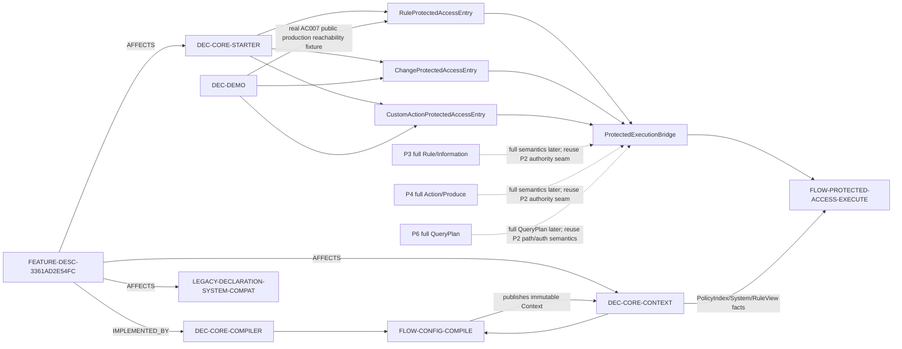

# 需求关联、影响策略与跨模块实现映射

- Project：`doc-eq-code`
- Version：`V_1.0`
- Revision：`BM-R15 / FLOW-R05 / DESIGN-P2-R17 / TESTDESIGN-P2-R18`
- Status：`NEEDS_REVIEW / MACHINE_BLOCKED`
- AC-007 Decision：`OPTION_B / ACTIVE / user-decided`

## P2 关系图



## CMI-P2-SYSTEM-RULEVIEW-001 — compile/publication

```text
source/frontends
 -> compiler System symbols
 -> owner-qualified references + RuleView View/rule closure
 -> P1 SharedModelPath/AccessMode one-way conversion
 -> exact P2 ModelPath/AccessOperation
 -> ModelAccessPolicyIndex
 -> derived CompiledSystem ownership snapshot
 -> SystemVersionIdentity(source digest + schema + compiler)
 -> semantic digest
 -> atomic CompiledModelSet/EngineContext publication
```

Ownership authorities：typed Data/View/RuleView/Information registries + CompiledRuleView rule closure + PolicyIndex keys。`CompiledSystem` 只是 derived read snapshot。

## CMI-P2-PROTECTED-ACCESS-001 — runtime authority seam

```text
representative production entry
 -> public ProtectedExecutionBridge
 -> starter internal issued invocation
 -> exact target resolution
 -> one-shot capability(target+operation)
 -> Gateway
 -> Guard exact current PolicyIndex lookup / runtime proof
 -> bound operation OR deterministic denial before effects
```

P1 `SharedModelPath/AccessMode` 不进入 runtime authority；runtime 只使用 P2 `ModelPath/AccessOperation/ModelAccessPolicyIndex`。

## CMI-P2-AC007-REPRESENTATIVE-CONSUMERS — Option B ACTIVE

User chose Option B。P2 current candidate must contain three real main-source entry adapters：

```text
RULE          RuleProtectedAccessEntry --------\
CHANGE        ChangeProtectedAccessEntry -------+--> same ProtectedExecutionBridge
CUSTOM_ACTION CustomActionProtectedAccessEntry -/
```

Frozen constraints：
- each entry's only protected-access authority dependency = `ProtectedExecutionBridge`；
- no Gateway/Guard/resolver/raw operation/secondary PolicyIndex/issued-pair/capability dependency；
- same Context + exact invocation + runtime facts -> same authorization classification across three entries；
- allow/deny paths executed through normal public production construction；test-only wrapper/reflection/internal shortcut is invalid evidence；
- unauthorized path effects=0；authorized effect occurs only after Guard。

## Downstream stage boundary

Option B keeps original AC-007 concrete-entry acceptance in P2 but does not move full downstream engines into P2：

- P3 full Rule/Information evaluation semantics remain P3；
- P4 full change/custom-action/Action/Produce execution state machine remains P4；
- P6 full QueryPlan compile/execute remains P6；
- all future protected accesses must reuse P2 Bridge/Gateway/Guard authority seam and cannot create bypass authority。

## Compatibility

Existing public `SystemKey(String)/name()`、`RuleViewKey(SystemKey,String)/owner()/name()`、EngineContext constructor、legacy CompiledModelSet constructor remain。Legacy declaration compatibility read-only 到 P7。

## Gate

AC-007 user decision is satisfied。Requirement/BM/BusinessFlow/Architecture/API/Impact/CrossModule/Concurrency exact Reviews and machine risk detection remain open；Implementation Plan/TDD/Development BLOCKED。
