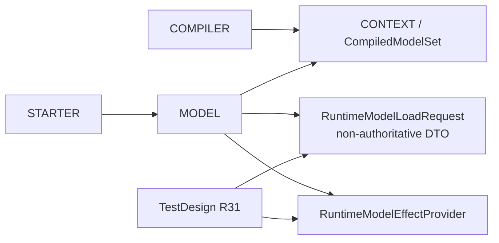

<!-- GENERATED projection from dependency_impact.yaml; edit the structured Impact as authority. -->
# P2 Dependency Graph / Cross-module Projection

- Revision: `P2-IMPACT-R29`
- Candidate: `BM-R20 / FLOW-R11 / DESIGN-P2-R30 / TESTDESIGN-P2-R31`
- BM-R20 and FLOW-R11 unchanged.



## Trust/effect chain

```text
MODEL production lifecycle
 -> RuntimeModelLoadRequest(plan + real origin + rule + connection)
 -> root validates captured Context/materialization
 -> typed ModelDataFactory
 -> 3-arg ModelLoader
 -> MODEL ContainerFactory-created Container
 -> SAME ModelData -> Handle -> Scope
 -> STARTER session register/seal + effect bind
 -> resolver -> capability -> Guard
 -> private MODEL port rechecks same object -> effect
```

`RuntimeModelLoadRequest` does not grant READ/WRITE authority. Opaque invocation token design is deferred/not current. Production Container remains MODEL-owned. Business consumers have no MODEL loading/effect bypass.

## Impact policies

| ID | Boundary | Fail closed |
|---|---|---|
| IMP-P2-CONTEXT-PUBLICATION-R29 | compiler -> immutable Context/materialization | bad/incomplete descriptor blocks publication |
| IMP-P2-DIRECT-LOAD-R29 | MODEL lifecycle -> root.load(request) | closed root / invalid plan / missing descriptor / incompatible origin / container reject => no handle/scope/STARTER/Guard/effect |
| IMP-P2-EFFECT-BINDING-R29 | scope/session -> STARTER -> MODEL effect | binding/target/Guard mismatch => no unauthorized effect |

## CMI mapping

- `CMI-P2-COMPILE-005`: unchanged typed materialization aggregate publication.
- `CMI-P2-PROTECTED-ACCESS-009`: request loading establishes FLOW-R11 trusted-frame precondition; STEP-01 validate; STEP-02 register/seal + effect bind; STEP-03 resolve; STEP-04 capability; STEP-05 Guard; STEP-06 same-object MODEL effect.
