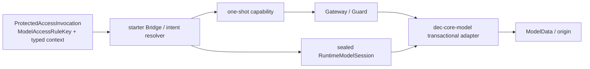

# 需求关联、影响策略与跨模块实现映射

- Project：`doc-eq-code`
- Version：`V_1.0`
- Revision：`BM-R19 / FLOW-R09 / DESIGN-P2-R21 / TESTDESIGN-P2-R22 / P2-IMPACT-R21`
- Status：`NEEDS_REVIEW / MACHINE_BLOCKED`
- Decisions：AC-007 `OPTION_B / ACTIVE`；AccessOperation `READ_WRITE_ONLY / ACTIVE`

## Revision direction

```text
REQAN-P2-R01 + Overlay R04
 -> BM-R19
 -> FLOW-R09
 -> DESIGN-P2-R21
 -> TESTDESIGN-P2-R22
```

## Authority / runtime graph



## Key boundaries

```text
ModelAccessRuleKey = authorization owner System + TargetKey(shared ViewKey) + ModelPath + READ/WRITE
ResolvedWriteIntent = ModelAccessRuleKey + typed frame/owner/optional cursor + expected mutation version
ResolvedProtectedWriteAccess = invocationId + RuntimeObjectId + ResolvedWriteIntent
```

No second WRITE ModelPath exists.

## Runtime object lifecycle

`RuntimeObjectId` resolves only in the composition/frame-scoped sealed RuntimeModelSession. Missing/stale/cross-session IDs fail closed. No global mutable registry.

## Failure / concurrency

Guard-approved WRITE is transactional: success commits once then returns receipt; failure rollback/restores observable state and receipt is absent. Same-version capabilities racing the same object/path yield at most one commit; stale loser(s) mutate zero times.

## Gate

20 formal P1 findings remain OPEN pending same-revision Review/Evidence. `FND-P2-REV-020` semantic fix is independently verified but not formally closed. Risk scan, Implementation Plan, TDD and Development remain BLOCKED.
