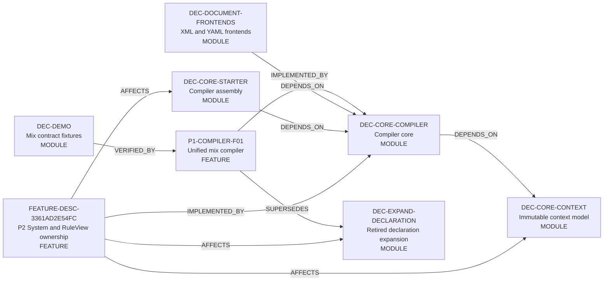

<!-- GENERATED by scripts/render_relationships.py; edit dependency_impact.yaml instead. -->
# 需求关联、影响策略与跨模块实现映射

- Project：`doc-eq-code`
- Version：`V_1.0`
- Revision：`BM-R06@6a0bce4fa0ae`

## 需求—需求关系图

- 本 revision 无适用关系。

## 需求—功能追踪图

- 本 revision 无适用关系。

## 功能—功能影响图



## 关系明细

| ID | From | 类型 | To | 条件 | 理由 | Trace IDs |
|---|---|---|---|---|---|---|
| REL-P1-COMPILER-IMPLEMENTS | P1-COMPILER-F01 | IMPLEMENTED_BY | DEC-CORE-COMPILER |  | Compiler owns the session, deterministic pipeline, and atomic publication coordination. | TR-P1-COMPILER-001<br>TR-P1-COMPILER-003<br>TR-P1-COMPILER-004<br>TR-P1-COMPILER-005 |
| REL-COMPILER-CONTEXT | DEC-CORE-COMPILER | DEPENDS_ON | DEC-CORE-CONTEXT | compilation has no ERROR | Compiler constructs context-owned immutable publication models; context never depends on compiler. | TR-P1-COMPILER-004<br>TR-P1-COMPILER-005<br>TR-P1-COMPILER-006 |
| REL-FRONTENDS-COMPILER | DEC-DOCUMENT-FRONTENDS | DEPENDS_ON | DEC-CORE-COMPILER | source format is registered | Concrete frontend implementations depend on compiler SPI and context value contracts; compiler invokes only injected SPI instances. | TR-P1-COMPILER-001<br>TR-P1-COMPILER-002 |
| REL-STARTER-COMPILER | DEC-CORE-STARTER | DEPENDS_ON | DEC-CORE-COMPILER |  | Starter assembles providers, frontends, expectedCurrent, and publisher, then invokes compileAndPublish once. | TR-P1-COMPILER-005 |
| REL-DEMO-VERIFIES-COMPILER | DEC-DEMO | VERIFIED_BY | P1-COMPILER-F01 |  | Demo resources are contract fixtures only and are never a production dependency. | TR-P1-COMPILER-001<br>TR-P1-COMPILER-008<br>TR-P1-COMPILER-009 |
| REL-P1-RETIRES-DECLARATION | P1-COMPILER-F01 | SUPERSEDES | DEC-EXPAND-DECLARATION |  | The unified compiler removes the temporary declaration module without an adapter or dual runtime. | TR-P1-COMPILER-007 |
| REL-P2-SYSTEM-RULEVIEW-COMPILER | FEATURE-DESC-3361AD2E54FC | IMPLEMENTED_BY | DEC-CORE-COMPILER |  | Compiler owns System registration, RuleView composite resolution, ModelPath compilation, static access validation and atomic publication. | TR-P2-SYSTEM-RULEVIEW-001<br>TR-P2-SYSTEM-RULEVIEW-002<br>TR-P2-SYSTEM-RULEVIEW-003<br>TR-P2-SYSTEM-RULEVIEW-004<br>TR-P2-SYSTEM-RULEVIEW-005<br>TR-P2-SYSTEM-RULEVIEW-008<br>TR-P2-SYSTEM-RULEVIEW-009 |
| REL-P2-SYSTEM-RULEVIEW-CONTEXT | FEATURE-DESC-3361AD2E54FC | AFFECTS | DEC-CORE-CONTEXT | candidate compilation has no ERROR | Published Context exposes immutable System- and RuleView-qualified compiled facts and access rules without global mutable lookup. | TR-P2-SYSTEM-RULEVIEW-002<br>TR-P2-SYSTEM-RULEVIEW-003<br>TR-P2-SYSTEM-RULEVIEW-004<br>TR-P2-SYSTEM-RULEVIEW-008 |
| REL-P2-SYSTEM-RULEVIEW-STARTER | FEATURE-DESC-3361AD2E54FC | AFFECTS | DEC-CORE-STARTER |  | Runtime assembly/callers resolve RuleView using system-ref + rule-ref and honor compiled/runtime access decisions without bare-name fallback. | TR-P2-SYSTEM-RULEVIEW-003<br>TR-P2-SYSTEM-RULEVIEW-006<br>TR-P2-SYSTEM-RULEVIEW-007 |
| REL-P2-SYSTEM-RULEVIEW-DECLARATION | FEATURE-DESC-3361AD2E54FC | AFFECTS | DEC-EXPAND-DECLARATION |  | P2 preserves the declaration compatibility boundary and must not create a second runtime authority; final convergence remains P7. | TR-P2-SYSTEM-RULEVIEW-010 |

## 关联对象处置策略

| ID | 来源动作 | 目标 | 策略 | 条件 | 一致性 | 失败/补偿 | Case |
|---|---|---|---|---|---|---|---|
| IMP-P1-COMPILER-PUBLICATION | P1-COMPILER-F01.compileAndPublish | DEC-CORE-CONTEXT<br>DEC-CORE-STARTER | REJECT_OPERATION | compilation contains ERROR<br>deadline or cancellation is observed<br>candidate construction or compare-and-set fails | ATOMIC | Return FailedCompilationResult with a stable Diagnostic and leave the caller-held old EngineContext unchanged.; 补偿: No data compensation is required because an unpublished candidate is never visible. | CASE-P1-CONTEXT-001<br>CASE-P1-PUBLISH-ATOMIC-001 |
| IMP-P1-DECLARATION-RETIREMENT | P1-COMPILER-F01.retireTemporaryDeclarationModule | DEC-EXPAND-DECLARATION | CASCADE_HARD_DELETE | unified compiler contract is the only implementation path | ATOMIC | Any residue blocks completion.; 补偿: Repository recovery uses Git revert; no runtime adapter is retained. | CASE-P1-RETIREMENT-001 |
| IMP-P2-MODEL-ACCESS-AUTHORIZATION | FEATURE-DESC-3361AD2E54FC.compileAndAuthorizeModelAccess | DEC-CORE-COMPILER<br>DEC-CORE-CONTEXT<br>DEC-CORE-STARTER | REJECT_OPERATION | static access is undeclared or invalid<br>runtime guard denies a genuinely dynamic access | ATOMIC | Emit stable source-aware denial and preserve the old EngineContext or current business state.; 补偿: No compensation is required for denied access because no mutation is allowed before authorization. | CASE-P2-ACCESS-STATIC-001<br>CASE-P2-ACCESS-RUNTIME-001<br>CASE-P2-ACCESS-NO-BYPASS-001 |
| IMP-P2-DECLARATION-BOUNDARY | FEATURE-DESC-3361AD2E54FC.preserveDeclarationCompatibilityBoundary | DEC-EXPAND-DECLARATION | RETAIN_UNCHANGED | current phase is P2 | ATOMIC | Any attempt to delete the boundary or create a second runtime authority blocks P2 completion.; 补偿: Revert the P2 change that crosses the declared phase boundary. | CASE-P2-DECLARATION-BOUNDARY-001 |

# 跨模块实现映射

## CMI-P1-COMPILER-001 Deterministic configuration compilation and publication

- 触发：Starter or a test caller submits a root SourceReference and explicit publication request.

```mermaid
sequenceDiagram
  participant P_df59f7e125 as STARTER: Assemble explicit provider, frontend registry, expectedCurrent, and ContextPublisher; receive the final result without republishing.
  participant P_24bc64dce0 as COMPILER: Own CompilationSession, deterministic passes, digest, candidate construction, and atomic publication coordination.
  participant P_3c7d1d0a37 as XML-YAML: Securely convert DocumentSource into CanonicalDocumentNode without global mutation.
  participant P_3b65d1690c as CONTEXT: Provide compiler-neutral immutable keys, registries, CompiledModelSet, EngineContext, and read-only projection.
  participant P_771569675f as CALLER-CONTEXT: Implement the caller-scoped compare-and-set holder supplied through PublicationRequest.
  P_df59f7e125->>P_24bc64dce0: CMSTEP-P1-COMPILER-01 / Invoke compileAndPublish with explicit requests / DEC_COMPILER_api_contract.md#api-compiler
  Note over P_df59f7e125,P_24bc64dce0: 失败: Invalid business input becomes FailedCompilationResult; constructor null remains a caller programming error.
  P_24bc64dce0->>P_3c7d1d0a37: CMSTEP-P1-COMPILER-02 / Resolve sources and parse canonical nodes / DEC_COMPILER_api_contract.md#api-source-frontend
  Note over P_24bc64dce0,P_3c7d1d0a37: 失败: Security, policy, IO, and syntax ERROR stop publication.
  P_24bc64dce0->>P_24bc64dce0: CMSTEP-P1-COMPILER-03 / Build Raw definitions, register symbols, resolve references, classify Deferred, and compute digest input / DEC_COMPILER_design.md#design-compiler-pipeline
  Note over P_24bc64dce0,P_24bc64dce0: 失败: Aggregate ERROR and transition the Session to FAILED.
  P_24bc64dce0->>P_3b65d1690c: CMSTEP-P1-COMPILER-04 / Construct immutable CompiledModelSet and candidate EngineContext / DEC_COMPILER_design.md#design-compiled-model-set
  Note over P_24bc64dce0,P_3b65d1690c: 失败: Construction failure returns MIX-CONTEXT-CONSTRUCTION-FAILED.
  P_24bc64dce0->>P_771569675f: CMSTEP-P1-COMPILER-05 / Invoke the caller-injected ContextPublisher exactly once / DEC_COMPILER_api_contract.md#api-publication
  Note over P_24bc64dce0,P_771569675f: 失败: Conflict, null, or exception returns FAILED and leaves old Context unchanged.
  P_24bc64dce0-->>P_df59f7e125: CMSTEP-P1-COMPILER-06 / Return PublishedCompilationResult or FailedCompilationResult / DEC_COMPILER_api_contract.md#api-result
  Note over P_24bc64dce0,P_df59f7e125: 失败: No partial result is returned.
```

### 成功条件

- The immutable candidate becomes visible exactly once and the returned status is PUBLISHED.
- Context never depends on compiler and Starter never republishes after return.
- Equal semantic inputs and versions produce equal semanticDigest.

### 失败与补偿

- `CMFAIL-P1-COMPILER-PARSE` @ `CMSTEP-P1-COMPILER-02`：Source policy, secure parsing, or syntax failure → Session reaches FAILED and no publisher call occurs.；补偿：Discard Session-local source and canonical builders.；人工恢复：Fix configuration using Diagnostic SourceRef and submit a new request.
- `CMFAIL-P1-COMPILER-SEMANTIC` @ `CMSTEP-P1-COMPILER-03`：Structural, symbol, reference, ownership, selector, or Deferred ERROR → Session reaches FAILED and no CompiledModelSet is published.；补偿：Discard Session-local semantic builders.；人工恢复：Fix the referenced definition and submit a new request.
- `CMFAIL-P1-COMPILER-PUBLISH` @ `CMSTEP-P1-COMPILER-05`：ContextPublisher reports conflict, returns null, or throws → Session reaches FAILED and the old EngineContext remains visible.；补偿：Discard the unpublished candidate.；人工恢复：Re-read expectedCurrent and explicitly submit a new compilation request if retry is desired.

## CMI-P2-SYSTEM-RULEVIEW-001 System-scoped RuleView and fail-closed model access compilation/runtime handoff

- 触发：A caller compiles configuration containing System, RuleView and model-access facts, then resolves or executes a System-owned RuleView.

```mermaid
sequenceDiagram
  participant P_366c24f388 as FRONTEND: Preserve explicit System ownership, RuleView system/name and model-access SourceRef facts without global mutation.
  participant P_4adeaf1414 as COMPILER: Register System identities, resolve RuleView composite keys, compile ModelPath, make static access decisions and build a complete immutable candidate.
  participant P_9ba9e4fea9 as CONTEXT: Hold immutable owner-qualified System/RuleView/access facts and keep Context instances isolated.
  participant P_088442a8d8 as STARTER: Use system-ref + rule-ref for runtime lookup and route genuinely dynamic access through the common Guard before mutation.
  P_366c24f388->>P_4adeaf1414: CMSTEP-P2-SYSTEM-RULEVIEW-01 / Submit explicit System/RuleView/model-access canonical facts
  Note over P_366c24f388,P_4adeaf1414: 失败: Malformed or unknown facts become Diagnostic; no runtime state is changed.
  P_4adeaf1414->>P_9ba9e4fea9: CMSTEP-P2-SYSTEM-RULEVIEW-02 / Publish complete owner-qualified System, RuleView and access candidate
  Note over P_4adeaf1414,P_9ba9e4fea9: 失败: Any ERROR leaves the old Context unchanged.
  P_088442a8d8->>P_9ba9e4fea9: CMSTEP-P2-SYSTEM-RULEVIEW-03 / Resolve RuleView by system-ref + rule-ref
  Note over P_088442a8d8,P_9ba9e4fea9: 失败: Unknown composite key or bare-name request fails; no fallback lookup.
  P_088442a8d8->>P_9ba9e4fea9: CMSTEP-P2-SYSTEM-RULEVIEW-04 / Request dynamic model access authorization before mutation when compilation marked RuntimeGuardRequired
  Note over P_088442a8d8,P_9ba9e4fea9: 失败: DENY is fail-closed and preserves current state.
```

### 成功条件

- System and RuleView identities are deterministic and owner-qualified
- static illegal access blocks publication
- dynamic denial occurs before mutation
- declaration compatibility remains a P7 boundary

### 失败与补偿

- `CMFAIL-P2-SYSTEM-RULEVIEW-01` @ `CMSTEP-P2-SYSTEM-RULEVIEW-02`：duplicate/unknown/path/static permission error → candidate is not published and old Context remains active；补偿：无；人工恢复：Correct configuration and recompile.
- `CMFAIL-P2-SYSTEM-RULEVIEW-02` @ `CMSTEP-P2-SYSTEM-RULEVIEW-03`：bare RuleView name or unknown composite key → lookup fails explicitly without cross-System fallback；补偿：无；人工恢复：Supply explicit valid system-ref + rule-ref.
- `CMFAIL-P2-SYSTEM-RULEVIEW-03` @ `CMSTEP-P2-SYSTEM-RULEVIEW-04`：runtime Guard denies access → operation fails before mutation or external side effect；补偿：无；人工恢复：Correct authority/resource state before retry.
