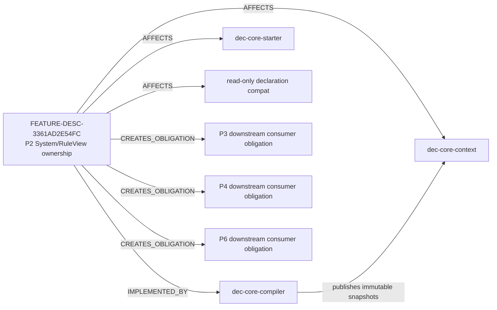
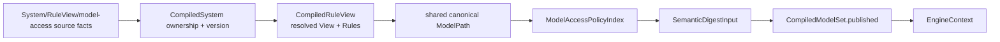
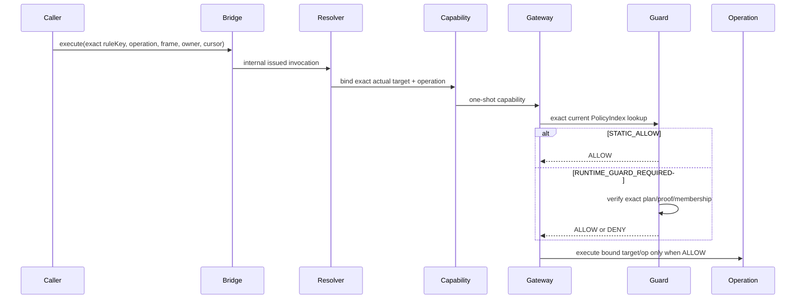

<!-- GENERATED-CANDIDATE from project_doc/docs/_relations/dependency_impact.yaml; Revision BM-R13. -->
# 需求关联、影响策略与跨模块实现映射

- Project：`doc-eq-code`
- Version：`V_1.0`
- Revision：`BM-R13`
- Status：`CANDIDATE / NEEDS_EXACT_REVIEW / MACHINE_BLOCKED`

## P2 关系图



## P2 publication closure



任一 ownership / RuleView ref / ModelPath / policy ERROR 都在 publication 前失败，old Context 保留。

## Protected-access seam



## Current requirement decisions

- `DEC-P2-DIRECT-BRIDGE-AUTHORITY-001`：caller 当前可以选择 exact compiler-published ruleKey/op；无 token/recognizes/claim。
- `DEC-P2-AC007-STAGE-BOUNDARY-001`：P2 验收唯一 production seam 与无合法旁路；P3/P4/P6 concrete consumer integration 是 downstream obligation。

## Impact policies

| ID | 核心约束 | Blocking Case |
|---|---|---|
| IMP-P2-SYSTEM-OWNERSHIP | ownership/version snapshot 与 typed facts 完整一致并进入 digest | CASE-P2-TD-SYSTEM-OWNERSHIP-SNAPSHOT-001 / SYSTEM-VERSION-IDENTITY-001 |
| IMP-P2-SHARED-MODEL-PATH | rule/change/query-contract/model-access 共用同一 canonical ModelPath | CASE-P2-TD-MODEL-PATH-CROSS-CONSUMER-EQUIVALENCE-001 |
| IMP-P2-MODEL-ACCESS-AUTHORIZATION | exact operation-qualified policy；一种权限不隐含另一种 | CASE-P2-TD-ACCESS-NON-IMPLICATION-001 |
| IMP-P2-PROTECTED-SEAM | Bridge→Gateway→Guard 是唯一 P2 production protected path | CASE-P2-TD-PRODUCTION-SEAM-NO-LEGAL-BYPASS-001 |
| IMP-P2-DIAGNOSTIC-DENIAL | compile ERROR/runtime DENY 重复执行稳定、可定位、不泄密 | CASE-P2-TD-RUNTIME-DENIAL-DIAGNOSTIC-DETERMINISM-001 |
| IMP-P2-ATOMIC-PUBLICATION | ownership/RuleView/policy/digest 同一原子候选 | CASE-P2-TD-ATOMIC-PUBLICATION-001 |
| IMP-P2-DECLARATION-BOUNDARY | legacy 只读直到 P7；不恢复第二 runtime | CASE-P2-TD-DECLARATION-BOUNDARY-001 |

## Downstream obligations

```text
P3 Rule/Information consumer
  -> MUST integrate through P2 protected seam

P4 change/custom-action/produce consumer
  -> MUST integrate through P2 protected seam

P6 QueryPlan consumer
  -> MUST reuse shared ModelPath contract
  -> MUST integrate protected model read through P2 seam
```

这些 obligation 不是当前 P2 implementation evidence；只有对应后续阶段的 current-revision integration test 才能关闭。
