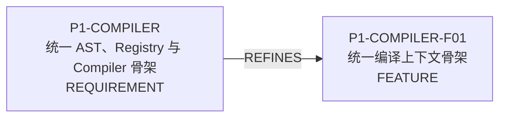
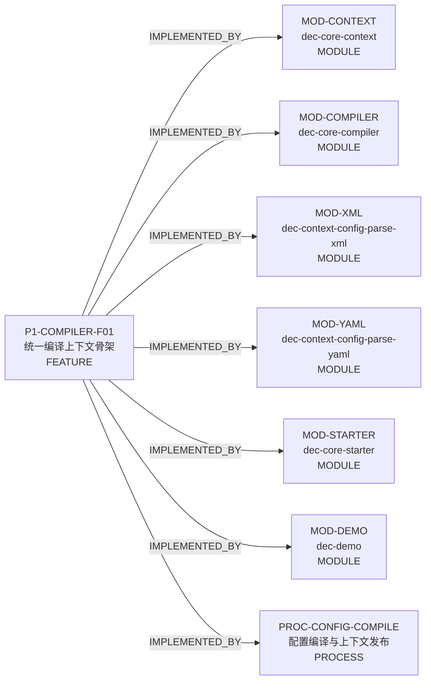
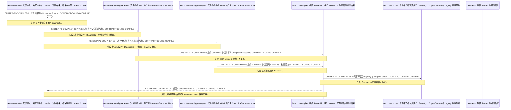

<!-- GENERATED by scripts/render_relationships.py; edit dependency_impact.yaml instead. -->
# 需求关联、影响策略与跨模块实现映射

- Project：`doc-eq-code-Dgremlin`
- Version：`V_1.0`
- Revision：`DEP-R01@p1-analysis`

## 需求—需求关系图

- 本 revision 无适用关系。

## 需求—功能追踪图

## 功能—功能影响图

## 关系明细

| ID | From | 类型 | To | 条件 | 理由 | Trace IDs |
|---|---|---|---|---|---|---|
| REL-P1-REQ-FEATURE | P1-COMPILER | REFINES | P1-COMPILER-F01 |  | 需求由单一 P1 编译骨架功能承载。 | TR-P1-COMPILER-001 TR-P1-COMPILER-002 TR-P1-COMPILER-003 TR-P1-COMPILER-004 TR-P1-COMPILER-005 TR-P1-COMPILER-006 |
| REL-P1-FEATURE-CONTEXT | P1-COMPILER-F01 | IMPLEMENTED_BY | MOD-CONTEXT |  | 该模块承担统一编译链中的明确职责。 | TR-P1-COMPILER-001 TR-P1-COMPILER-002 TR-P1-COMPILER-003 TR-P1-COMPILER-004 TR-P1-COMPILER-005 TR-P1-COMPILER-006 |
| REL-P1-FEATURE-COMPILER | P1-COMPILER-F01 | IMPLEMENTED_BY | MOD-COMPILER |  | 该模块承担统一编译链中的明确职责。 | TR-P1-COMPILER-001 TR-P1-COMPILER-002 TR-P1-COMPILER-003 TR-P1-COMPILER-004 TR-P1-COMPILER-005 TR-P1-COMPILER-006 |
| REL-P1-FEATURE-XML | P1-COMPILER-F01 | IMPLEMENTED_BY | MOD-XML |  | 该模块承担统一编译链中的明确职责。 | TR-P1-COMPILER-001 TR-P1-COMPILER-002 TR-P1-COMPILER-003 TR-P1-COMPILER-004 TR-P1-COMPILER-005 TR-P1-COMPILER-006 |
| REL-P1-FEATURE-YAML | P1-COMPILER-F01 | IMPLEMENTED_BY | MOD-YAML |  | 该模块承担统一编译链中的明确职责。 | TR-P1-COMPILER-001 TR-P1-COMPILER-002 TR-P1-COMPILER-003 TR-P1-COMPILER-004 TR-P1-COMPILER-005 TR-P1-COMPILER-006 |
| REL-P1-FEATURE-STARTER | P1-COMPILER-F01 | IMPLEMENTED_BY | MOD-STARTER |  | 该模块承担统一编译链中的明确职责。 | TR-P1-COMPILER-001 TR-P1-COMPILER-002 TR-P1-COMPILER-003 TR-P1-COMPILER-004 TR-P1-COMPILER-005 TR-P1-COMPILER-006 |
| REL-P1-FEATURE-DEMO | P1-COMPILER-F01 | IMPLEMENTED_BY | MOD-DEMO |  | 该模块承担统一编译链中的明确职责。 | TR-P1-COMPILER-001 TR-P1-COMPILER-002 TR-P1-COMPILER-003 TR-P1-COMPILER-004 TR-P1-COMPILER-005 TR-P1-COMPILER-006 |
| REL-P1-FEATURE-FLOW | P1-COMPILER-F01 | IMPLEMENTED_BY | PROC-CONFIG-COMPILE |  | 功能通过稳定七步编译流程实现。 | TR-P1-COMPILER-001 TR-P1-COMPILER-002 TR-P1-COMPILER-003 TR-P1-COMPILER-004 |

## 关联对象处置策略

| ID | 来源动作 | 目标 | 策略 | 条件 | 一致性 | 失败/补偿 | Case |
|---|---|---|---|---|---|---|---|
| IMP-P1-COMPILER-001 | P1-COMPILER-F01.introduceCanonicalFrontend | MOD-XML MOD-YAML | TRIGGER_FOLLOWUP | P1 implementation and migration window | BEST_EFFORT | 阻断当前阶段或编译发布，保留旧路径和证据，不伪报完成。; 补偿: 丢弃本次构建产物；不回滚或改写旧事实。 | CASE-P1-IMPACT-001 |
| IMP-P1-COMPILER-002 | P1-COMPILER-F01.enforceDiagnosticGate | MOD-COMPILER MOD-STARTER | REJECT_OPERATION | P1 implementation and migration window | ATOMIC | 阻断当前阶段或编译发布，保留旧路径和证据，不伪报完成。; 补偿: 丢弃本次构建产物；不回滚或改写旧事实。 | CASE-P1-IMPACT-002 |
| IMP-P1-COMPILER-003 | P1-COMPILER-F01.replaceStringRegistryBuildPath | MOD-CONTEXT MOD-COMPILER | TRIGGER_FOLLOWUP | P1 implementation and migration window | BEST_EFFORT | 阻断当前阶段或编译发布，保留旧路径和证据，不伪报完成。; 补偿: 丢弃本次构建产物；不回滚或改写旧事实。 | CASE-P1-IMPACT-003 |
| IMP-P1-COMPILER-004 | P1-COMPILER-F01.publishImmutableContext | MOD-CONTEXT MOD-STARTER | RETAIN_FOR_AUDIT | P1 implementation and migration window | ATOMIC | 阻断当前阶段或编译发布，保留旧路径和证据，不伪报完成。; 补偿: 丢弃本次构建产物；不回滚或改写旧事实。 | CASE-P1-IMPACT-004 |
| IMP-P1-COMPILER-005 | P1-COMPILER-F01.introduceLegacyReadOnlyView | MOD-CONTEXT | RETAIN_FOR_AUDIT | P1 implementation and migration window | BEST_EFFORT | 阻断当前阶段或编译发布，保留旧路径和证据，不伪报完成。; 补偿: 丢弃本次构建产物；不回滚或改写旧事实。 | CASE-P1-IMPACT-005 |
| IMP-P1-COMPILER-006 | P1-COMPILER-F01.freezeP1ScopeAndContracts | MOD-DEMO | RETAIN_FOR_AUDIT | P1 implementation and migration window | BEST_EFFORT | 阻断当前阶段或编译发布，保留旧路径和证据，不伪报完成。; 补偿: 丢弃本次构建产物；不回滚或改写旧事实。 | CASE-P1-IMPACT-006 |

# 跨模块实现映射

## CMI-P1-COMPILER-001 统一配置编译跨模块实现映射

- 触发：调用方提交 XML/YAML DocumentSource 集合

### 成功条件

- 无 ERROR 时返回不可变 EngineContext。
- Diagnostics 与 digest 可重复。
- 既有 Context 不被本次编译修改。

### 失败与补偿

- `CMFAIL-P1-COMPILER-001` @ `CMSTEP-P1-COMPILER-02`：XML 不安全或格式错误 → 拒绝该输入并使本次结果不可发布。；补偿：丢弃本次 Session 的构建状态；人工恢复：修正文档后重新编译；旧 Context 继续服务。
- `CMFAIL-P1-COMPILER-002` @ `CMSTEP-P1-COMPILER-06`：重复符号、未知引用或语义错误 → 返回稳定 Diagnostics，不创建 EngineContext。；补偿：丢弃 RegistryBuilder 和未发布对象；人工恢复：根据 Diagnostic 定位并修复，再以新 Session 重试。
