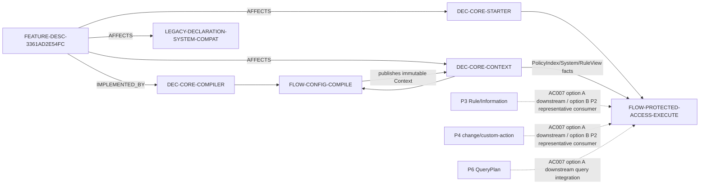

# 需求关联、影响策略与跨模块实现映射

- Project：`doc-eq-code`
- Version：`V_1.0`
- Revision：`BM-R14 / FLOW-R04 / DESIGN-P2-R16`
- Status：`NEEDS_REVIEW / MACHINE_BLOCKED / AC007_PENDING_USER_DECISION`

## P2 关系图



## Current P2 cross-module facts

### CMI-P2-SYSTEM-RULEVIEW-001 — compile/publication

```text
source/frontends
 -> compiler System symbols
 -> owner-qualified references + RuleView View/rule closure
 -> P1 SharedModelPath/AccessMode one-way conversion
 -> exact P2 ModelPath/AccessOperation
 -> ModelAccessPolicyIndex
 -> derived CompiledSystem ownership snapshot
 -> SystemVersionIdentity(source digest + schema + compiler)
 -> semantic digest
 -> atomic CompiledModelSet/EngineContext publication
```

Ownership authorities：typed Data/View/RuleView/Information registries + CompiledRuleView rule closure + PolicyIndex keys。`CompiledSystem` 只是 derived read snapshot。

### CMI-P2-PROTECTED-ACCESS-001 — runtime protected access

```text
public ProtectedExecutionBridge
 -> starter internal issued invocation
 -> exact target resolution
 -> one-shot capability(target+operation)
 -> Gateway
 -> Guard exact current PolicyIndex lookup / runtime proof
 -> bound operation OR deterministic denial before effects
```

P1 `SharedModelPath/AccessMode` 不进入此 runtime flow；runtime authority 只使用 P2 `ModelPath/AccessOperation/ModelAccessPolicyIndex`。

## AC-007 pending decision

`DEC-P2-AC007-STAGE-BOUNDARY-001` 当前为 `PROPOSED / PENDING_USER_DECISION`：

- A：P2 final acceptance = seam/no-bypass；P3/P4/P6 concrete integrations downstream；
- B：P2 交付 representative Rule/change/custom-action production consumers 来执行原 literal AC-007。

因此图中的 P3/P4/P6 到 runtime flow 目前只是条件关系，不是 ACTIVE downstream acceptance，也不是当前 closure Evidence。

## Compatibility

Existing public `SystemKey(String)/name()`、`RuleViewKey(SystemKey,String)/owner()/name()` 保留；additive aliases 不替换现有 API。Legacy declaration compatibility read-only 到 P7。

## Gate

BusinessFlow/Architecture/API/Impact/CrossModule/Concurrency exact Reviews、AC-007 用户决策和 machine risk detection 均未闭环；Implementation Plan/TDD/Development BLOCKED。
