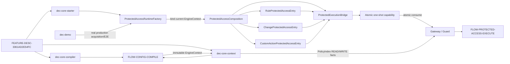

# 需求关联、影响策略与跨模块实现映射

- Project：`doc-eq-code`
- Version：`V_1.0`
- Revision：`BM-R16 / FLOW-R06 / DESIGN-P2-R18 / TESTDESIGN-P2-R19`
- Status：`NEEDS_REVIEW / MACHINE_BLOCKED`
- Decisions：AC-007 `OPTION_B / ACTIVE`；AccessOperation `READ_WRITE_ONLY / ACTIVE`

## P2 关系图



## Compile/publication

```text
source / P1 compatibility
 -> System symbols + owner refs
 -> CompiledRuleView + RuleKey(ownerRuleViewKey,localName) closure
 -> SharedModelPath -> exact ModelPath
 -> AccessMode.READ/WRITE -> AccessOperation.READ/WRITE
 -> exact CompiledModelAccessRule
 -> immutable PolicyIndex
 -> derived CompiledSystem ownership
 -> SystemVersionIdentity
 -> semantic digest
 -> atomic CompiledModelSet/EngineContext publication
```

Current P2 has no EXECUTE operation/source/policy/runtime branch。

## Runtime / AC-007 Option B

```text
normal starter composition root
 -> ProtectedAccessRuntimeFactory
 -> ProtectedAccessComposition(current EngineContext)
      -> same Bridge
      -> Rule entry ------\
      -> Change entry -----+-> same Bridge -> internal invocation -> target -> capability
      -> CustomAction ----/                                      -> atomic consume
                                                                  -> Gateway -> Guard
                                                                  -> READ/WRITE operation or DENY
```

AC-007 production Evidence must obtain entries through factory/composition。Manual `new Entry(testBridge)` may be a unit seam but cannot prove production reachability。

## Authority boundaries

- `CompiledSystem` ownership is projection only；Rule ownership authority = owning CompiledRuleView RuleKey closure；model-access authority = PolicyIndex。
- Business entries receive Bridge, not Gateway/Guard/resolver/raw operation/mutable PolicyIndex/capability mint。
- Capability atomic state `ISSUED -> CONSUMED` permits at most one successful concurrent consume。
- P2 canonical RuleView lookup has no new bare-name fallback。

## Downstream

P3 full Rule/Information、P4 full Action/Produce/change/custom-action state machines、P6 full QueryPlan remain downstream。They must reuse P2 path/authorization seam and may not introduce second authority。

## Gate

Requirement/BM/BusinessFlow/Architecture/API/Develop/Impact/CrossModule/Concurrency exact Reviews and risk detection remain open；Implementation Plan/TDD/Development remain BLOCKED。
