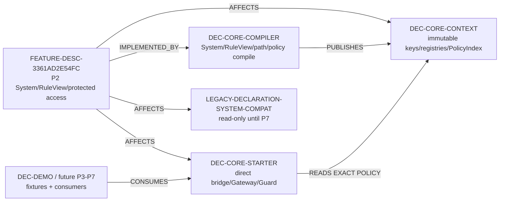
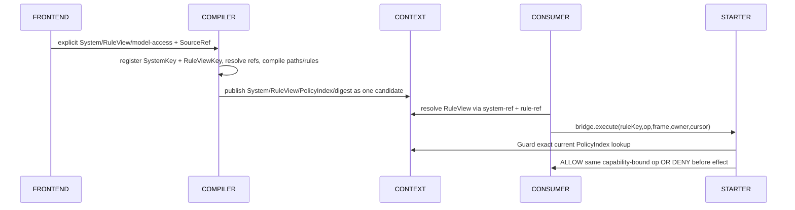

<!-- GENERATED/RESYNCED from project_doc/docs/_relations/dependency_impact.yaml for BM-R12 candidate. -->
# 需求关联、影响策略与跨模块实现映射

- Project：`doc-eq-code`
- Version：`V_1.0`
- Revision：`BM-R12`
- Status：`CANDIDATE_SYNCED / MACHINE_BLOCKED`

## 功能—模块影响图



## 关系明细

| ID | From | Type | To | Rationale | Trace IDs |
|---|---|---|---|---|---|
| REL-P2-SYSTEM-RULEVIEW-COMPILER | FEATURE-DESC-3361AD2E54FC | IMPLEMENTED_BY | DEC-CORE-COMPILER | Compiler owns explicit System registration, RuleView composite resolution, ModelPath/access compilation, PolicyIndex construction and atomic candidate publication. | TR-001/002/003/004/005/008/009 |
| REL-P2-SYSTEM-RULEVIEW-CONTEXT | FEATURE-DESC-3361AD2E54FC | AFFECTS | DEC-CORE-CONTEXT | Context owns immutable System/RuleView/PolicyIndex facts and context isolation. | TR-002/003/004/008 |
| REL-P2-SYSTEM-RULEVIEW-STARTER | FEATURE-DESC-3361AD2E54FC | AFFECTS | DEC-CORE-STARTER | Starter owns direct protected bridge, Gateway, Guard and runtime proof enforcement. | TR-003/006/007 |
| REL-P2-SYSTEM-RULEVIEW-DECLARATION | FEATURE-DESC-3361AD2E54FC | AFFECTS | LEGACY-DECLARATION-SYSTEM-COMPAT | P2 keeps only read-only compatibility and leaves final retirement to P7. | TR-010 |

## 影响策略

### IMP-P2-SYSTEM-RULEVIEW-PUBLICATION

```text
System/RuleView/path/policy semantic ERROR
 -> reject candidate publication
 -> old EngineContext remains visible
 -> no partial System/RuleView/PolicyIndex registry
```

Cases：System deterministic/duplicate、RuleView required/duplicate、atomic publication、diagnostic determinism。

### IMP-P2-MODEL-ACCESS-AUTHORIZATION

```text
direct bridge invocation
 -> exact current PolicyIndex selection
 -> Gateway/Guard
 -> static fast path OR runtime proof
 -> same capability-bound target/operation
```

DENY occurs before protected operation/effects。Same capability terminal success <= 1。Identical direct bridge scalar calls are independent invocations。

Decision：`DEC-P2-DIRECT-BRIDGE-AUTHORITY-001` permits caller-selected exact ruleKey/op among compiler-published PolicyIndex rules in current P2；consumer identity is provenance, not an authorization dimension。

### IMP-P2-DECLARATION-BOUNDARY

P2 does not restore retired `dec-expand-declaration`, does not write through legacy compatibility, and does not create a second registry/runtime authority。

# 跨模块实现映射

<a id="CMI-P2-SYSTEM-RULEVIEW-001"></a>
## CMI-P2-SYSTEM-RULEVIEW-001 Consolidated P2 compile/runtime handoff



### 成功条件

- explicit/deterministic System identity；
- RuleView composite identity and cross-System isolation；
- exact ModelPath + single PolicyIndex authority；
- STATIC_ALLOW also passes Guard；
- runtime-required proof only narrows compiler-published policy；
- no partial Context or second runtime authority。

### 当前限制

- AC-007 concrete Rule/change/custom-action/query executor integration is `CONTRACT_ONLY` until P3-P7 implementation exists；
- current direct caller rule/op authority follows the formal Decision record；
- candidate docs are not machine-published or PASSED。
