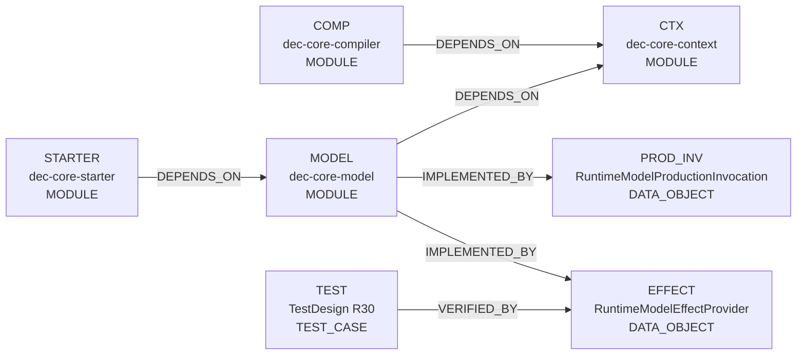
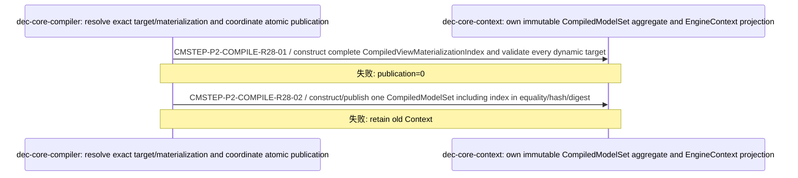

<!-- GENERATED by scripts/render_relationships.py; edit dependency_impact.yaml instead. -->
# 需求关联、影响策略与跨模块实现映射

- Project：`doc-eq-code`
- Version：`V_1.0`
- Revision：`P2-IMPACT-R28`

## 需求—需求关系图

- 本 revision 无适用关系。

## 需求—功能追踪图

- 本 revision 无适用关系。

## 功能—功能影响图



## 关系明细

| ID | From | 类型 | To | 条件 | 理由 | Trace IDs |
|---|---|---|---|---|---|---|
| REL-P2-R28-1 | COMP | DEPENDS_ON | CTX |  | Compiler publishes exact policy/binding plus typed materialization aggregate. | TR-P2-005<br>TR-P2-008 |
| REL-P2-R28-2 | MODEL | DEPENDS_ON | CTX |  | MODEL consumes only captured immutable context/materialization contracts. | TR-P2-006 |
| REL-P2-R28-3 | MODEL | IMPLEMENTED_BY | PROD_INV |  | MODEL production adapter mints the one-shot root-bound production invocation token. | TR-P2-006<br>TR-P2-009 |
| REL-P2-R28-4 | MODEL | IMPLEMENTED_BY | EFFECT |  | MODEL owns the scope-bound effect provider and actual operation port. | TR-P2-007<br>TR-P2-009 |
| REL-P2-R28-5 | STARTER | DEPENDS_ON | MODEL | FLOW-R11 protected access only | STARTER consumes trusted scope/effect provider, never caller-injected operation implementation. | TR-P2-006<br>TR-P2-007 |
| REL-P2-R28-6 | TEST | VERIFIED_BY | EFFECT |  | R30 proves effect binding, same-handle execution and no-bypass behavior. | TR-P2-009 |

## 关联对象处置策略

| ID | 来源动作 | 目标 | 策略 | 条件 | 一致性 | 失败/补偿 | Case |
|---|---|---|---|---|---|---|---|
| IMP-P2-CONTEXT-PUBLICATION-R28 | FLOW-CONFIG-COMPILE.publish exact policy/binding/materialization aggregate | COMP<br>CTX | REJECT_OPERATION | dynamic target lacks exactly one materialization descriptor<br>candidate aggregate/digest incomplete | ATOMIC | compile/publication ERROR; previous Context remains visible; 补偿: discard unpublished candidate | CASE-P2-TD-CONTEXT-MATERIALIZATION-INDEX-AGGREGATE-001<br>CASE-P2-TD-MATERIALIZATION-PUBLICATION-CLOSURE-001<br>CASE-P2-TD-ATOMIC-PUBLICATION-001 |
| IMP-P2-TRUSTED-PRODUCTION-R28 | FLOW-PROTECTED-ACCESS-EXECUTE.establish trusted production frame from one MODEL invocation and production Container | MODEL<br>CTX<br>PROD_INV | REJECT_OPERATION | token from another root<br>token reused<br>plan absent from captured Context<br>origin not materializable<br>production Container load rejected | ATOMIC | stable load failure; no scope/handle reaches STARTER; 补偿: discard unexposed association | CASE-P2-TD-PRODUCTION-PLAN-ORIGIN-SAME-INVOCATION-001<br>CASE-P2-TD-PRODUCTION-CONTAINER-TRUST-BOUNDARY-001<br>CASE-P2-TD-MODEL-EXECUTION-ROOT-LOAD-001 |
| IMP-P2-EFFECT-BINDING-R28 | FLOW-PROTECTED-ACCESS-EXECUTE.bind MODEL effect port to same sealed scope/session then execute only after Guard ALLOW | STARTER<br>MODEL<br>EFFECT | REJECT_OPERATION | scope/session mismatch<br>session unsealed/closed<br>resolved object not registered in bound session<br>Guard DENY<br>MODEL operation failure | ATOMIC | stable composition/operation denial; no unauthorized effect or success receipt; 补偿: close failed partial composition/session; no fallback provider | CASE-P2-TD-MODEL-EFFECT-PROVIDER-BINDING-001<br>CASE-P2-TD-MODEL-EFFECT-SAME-HANDLE-001<br>CASE-P2-TD-OPERATION-PORT-NOT-CALLER-INJECTABLE-001<br>CASE-P2-TD-RUNTIME-TARGET-SUBSTITUTION-001 |

# 跨模块实现映射

## CMI-P2-COMPILE-005 CompiledModelSet aggregate publication with typed materialization index

- 触发：FLOW-CONFIG-COMPILE



### 成功条件

- typed index is aggregate-owned
- no runtime materialization repair
- atomic Context publication

### 失败与补偿

- `CMFAIL-P2-COMPILE-R28-01` @ `CMSTEP-P2-COMPILE-R28-01`：required descriptor absent/duplicate → compile ERROR; publication=0；补偿：无；人工恢复：fix configuration and submit fresh candidate

## CMI-P2-PROTECTED-ACCESS-008 Trusted production invocation plus bound MODEL effect under FLOW-R11

- 触发：FLOW-PROTECTED-ACCESS-EXECUTE

```mermaid
sequenceDiagram
  participant P_6332d0f957 as dec-core-model: mint root-bound production invocation, create production Container, load same ModelData, mint scope/session/effect provider and own actual operation
  participant P_18545aa412 as dec-core-starter: validate scope, register/seal, bind effect provider, resolve/capability/Guard, invoke bound effect only after ALLOW
  participant P_883c7ed22d as dec-core-context: provide immutable binding/policy/materialization/result contracts
  P_6332d0f957->>P_6332d0f957: CMSTEP-P2-ACCESS-R28-00 / one active MODEL production invocation atomically mints a root-bound one-shot token; root uses ContainerFactory-selected production Container, exact captured plan/materialization and real origin to create/load one ModelData and trusted handle
  Note over P_6332d0f957,P_6332d0f957: 失败: no scope/handle exposure
  P_6332d0f957->>P_18545aa412: CMSTEP-P2-ACCESS-R28-01 / provide active MODEL-minted scope/frame; STARTER validates every handle plan/provenance against captured Context
  Note over P_6332d0f957,P_18545aa412: 失败: fail closed
  P_18545aa412->>P_6332d0f957: CMSTEP-P2-ACCESS-R28-02 / begin session, register exact frame handles, seal once, then bind scope.effectProvider to that same sealed session; retain operation port privately in composition
  Note over P_18545aa412,P_6332d0f957: 失败: stable session/effect binding code; capability/Guard/effect=0
  P_18545aa412->>P_6332d0f957: CMSTEP-P2-ACCESS-R28-03 / resolve exact plan to exactly one object registered in that sealed session
  Note over P_18545aa412,P_6332d0f957: 失败: NOT_FOUND/AMBIGUOUS/PROVENANCE_MISMATCH
  P_18545aa412->>P_18545aa412: CMSTEP-P2-ACCESS-R28-04 / freeze READ access or WRITE intent+stamp and one-shot capability for that exact target/path/version
  Note over P_18545aa412,P_18545aa412: 失败: intent 0/N fails closed
  P_18545aa412->>P_883c7ed22d: CMSTEP-P2-ACCESS-R28-05 / Guard exact ModelAccessRuleKey for the frozen target/proof
  Note over P_18545aa412,P_883c7ed22d: 失败: DENY; effect=0
  P_18545aa412->>P_6332d0f957: CMSTEP-P2-ACCESS-R28-06 / after ALLOW invoke the privately bound MODEL RuntimeModelOperationPort; provider/port rechecks same sealed session and registered runtimeObjectId before actual READ/WRITE
  Note over P_18545aa412,P_6332d0f957: 失败: scope/object/write mismatch fails closed; no fabricated success
```

### 成功条件

- public API cannot compose Plan A + Object B trusted load
- production Container is MODEL-created, not caller-injected
- effect provider is bound to same sealed scope/session
- Guard precedes actual MODEL effect
- same STEP-03 object is used by STEP-06
- business consumers have no MODEL effect bypass

### 失败与补偿

- `CMFAIL-P2-ACCESS-R28-01` @ `CMSTEP-P2-ACCESS-R28-00`：token/root mismatch or token reuse or trusted load failure → stable load failure; no scope/effect；补偿：无；人工恢复：start a fresh valid production invocation
- `CMFAIL-P2-ACCESS-R28-02` @ `CMSTEP-P2-ACCESS-R28-02`：session/effect provider cannot bind same scope/session → no composition; capability/Guard/effect=0；补偿：close partial session；人工恢复：fresh active scope/session
- `CMFAIL-P2-ACCESS-R28-03` @ `CMSTEP-P2-ACCESS-R28-06`：resolved object/session mismatches bound effect or MODEL operation fails → stable denial/failure; no unauthorized success；补偿：无；人工恢复：fresh valid intent when allowed
