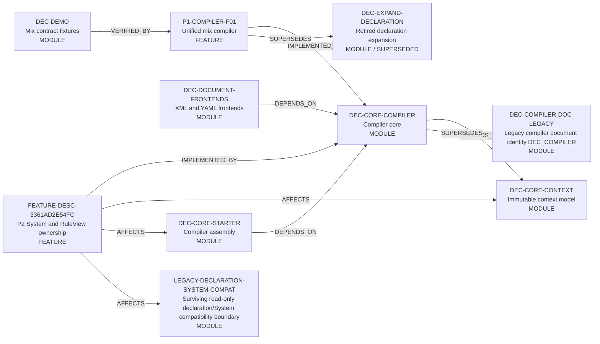

<!-- GENERATED from project_doc/docs/_relations/dependency_impact.yaml; BM-R08 connector render. -->
# 需求关联、影响策略与跨模块实现映射

- Project：`doc-eq-code`
- Version：`V_1.0`
- Revision：`BM-R08`

## 需求—需求关系图

- 本 revision 无适用关系。

## 需求—功能追踪图

- 本 revision 无适用关系。

## 功能—功能影响图



## 关系明细

| ID | From | 类型 | To | 条件 | 理由 | Trace IDs |
|---|---|---|---|---|---|---|
| REL-P1-COMPILER-IMPLEMENTS | P1-COMPILER-F01 | IMPLEMENTED_BY | DEC-CORE-COMPILER |  | Compiler owns the session, deterministic pipeline, and atomic publication coordination. | TR-P1-COMPILER-001<br>TR-P1-COMPILER-003<br>TR-P1-COMPILER-004<br>TR-P1-COMPILER-005 |
| REL-COMPILER-CONTEXT | DEC-CORE-COMPILER | DEPENDS_ON | DEC-CORE-CONTEXT | compilation has no ERROR | Compiler constructs context-owned immutable publication models; context never depends on compiler. | TR-P1-COMPILER-004<br>TR-P1-COMPILER-005<br>TR-P1-COMPILER-006 |
| REL-FRONTENDS-COMPILER | DEC-DOCUMENT-FRONTENDS | DEPENDS_ON | DEC-CORE-COMPILER | source format is registered | Concrete frontend implementations depend on compiler SPI and context value contracts; compiler invokes only injected SPI instances. | TR-P1-COMPILER-001<br>TR-P1-COMPILER-002 |
| REL-STARTER-COMPILER | DEC-CORE-STARTER | DEPENDS_ON | DEC-CORE-COMPILER |  | Starter assembles providers, frontends, expectedCurrent, and publisher, then invokes compileAndPublish once. | TR-P1-COMPILER-005 |
| REL-DEMO-VERIFIES-COMPILER | DEC-DEMO | VERIFIED_BY | P1-COMPILER-F01 |  | Demo resources are contract fixtures only and are never a production dependency. | TR-P1-COMPILER-001<br>TR-P1-COMPILER-008<br>TR-P1-COMPILER-009 |
| REL-P1-RETIRES-DECLARATION | P1-COMPILER-F01 | SUPERSEDES | DEC-EXPAND-DECLARATION |  | The unified compiler removes the temporary declaration module; the node remains only as historical retired fact. | TR-P1-COMPILER-007 |
| REL-P2-SYSTEM-RULEVIEW-COMPILER | FEATURE-DESC-3361AD2E54FC | IMPLEMENTED_BY | DEC-CORE-COMPILER |  | Compiler owns System registration, RuleView composite resolution, ModelPath compilation, static access validation and atomic publication. | TR-P2-SYSTEM-RULEVIEW-001<br>TR-P2-SYSTEM-RULEVIEW-002<br>TR-P2-SYSTEM-RULEVIEW-003<br>TR-P2-SYSTEM-RULEVIEW-004<br>TR-P2-SYSTEM-RULEVIEW-005<br>TR-P2-SYSTEM-RULEVIEW-008<br>TR-P2-SYSTEM-RULEVIEW-009 |
| REL-P2-SYSTEM-RULEVIEW-CONTEXT | FEATURE-DESC-3361AD2E54FC | AFFECTS | DEC-CORE-CONTEXT | candidate compilation has no ERROR | Published Context exposes immutable System- and RuleView-qualified compiled facts and access rules without global mutable lookup. | TR-P2-SYSTEM-RULEVIEW-002<br>TR-P2-SYSTEM-RULEVIEW-003<br>TR-P2-SYSTEM-RULEVIEW-004<br>TR-P2-SYSTEM-RULEVIEW-008 |
| REL-P2-SYSTEM-RULEVIEW-STARTER | FEATURE-DESC-3361AD2E54FC | AFFECTS | DEC-CORE-STARTER |  | Runtime assembly/callers route every protected READ/WRITE/EXECUTE through the common Guard without bare-name fallback. | TR-P2-SYSTEM-RULEVIEW-003<br>TR-P2-SYSTEM-RULEVIEW-006<br>TR-P2-SYSTEM-RULEVIEW-007 |
| REL-P2-SYSTEM-RULEVIEW-DECLARATION | FEATURE-DESC-3361AD2E54FC | AFFECTS | LEGACY-DECLARATION-SYSTEM-COMPAT | current phase is P2; compatibility access is read-only | P2 preserves only the surviving read-only compatibility boundary; DEC-EXPAND-DECLARATION remains retired. | TR-P2-SYSTEM-RULEVIEW-010 |
| REL-COMPILER-DOC-LINEAGE | DEC-CORE-COMPILER | SUPERSEDES | DEC-COMPILER-DOC-LEGACY |  | COMPILER is the canonical current documentation identity for the same logical compiler modeled historically under DEC_COMPILER. | TR-P1-COMPILER-001<br>TR-P2-SYSTEM-RULEVIEW-001<br>TR-P2-SYSTEM-RULEVIEW-010 |

## 关联对象处置策略

| ID | 来源动作 | 目标 | 策略 | 条件 | 一致性 | 失败/补偿 | Case |
|---|---|---|---|---|---|---|---|
| IMP-P1-COMPILER-PUBLICATION | P1-COMPILER-F01.compileAndPublish | DEC-CORE-CONTEXT<br>DEC-CORE-STARTER | REJECT_OPERATION | compilation contains ERROR<br>deadline or cancellation is observed<br>candidate construction or compare-and-set fails | ATOMIC | Return FailedCompilationResult and leave old EngineContext unchanged.; 补偿: no published candidate exists. | CASE-P1-CONTEXT-001<br>CASE-P1-PUBLISH-ATOMIC-001 |
| IMP-P1-DECLARATION-RETIREMENT | P1-COMPILER-F01.retireTemporaryDeclarationModule | DEC-EXPAND-DECLARATION | CASCADE_HARD_DELETE | unified compiler contract is the only implementation path | ATOMIC | Any residue blocks completion.; 补偿: Git revert only; no runtime adapter retained. | CASE-P1-RETIREMENT-001 |
| IMP-P2-MODEL-ACCESS-AUTHORIZATION | FEATURE-DESC-3361AD2E54FC.compileAndAuthorizeModelAccess | DEC-CORE-COMPILER<br>DEC-CORE-CONTEXT<br>DEC-CORE-STARTER | REJECT_OPERATION | static access invalid<br>Guard denies protected READ/WRITE/EXECUTE | ATOMIC | Deny before target operation/side effect and preserve current state.; 补偿: none required. | CASE-P2-ACCESS-STATIC-001<br>CASE-P2-ACCESS-RUNTIME-001<br>CASE-P2-ACCESS-NO-BYPASS-001 |
| IMP-P2-DECLARATION-BOUNDARY | FEATURE-DESC-3361AD2E54FC.preserveReadOnlyDeclarationCompatibilityBoundary | LEGACY-DECLARATION-SYSTEM-COMPAT | RETAIN_UNCHANGED | current phase is P2; read-only compatibility only | ATOMIC | Restoring DEC-EXPAND, writing through compatibility, or creating second runtime authority blocks P2.; 补偿: revert offending P2 change. | CASE-P2-DECLARATION-BOUNDARY-001 |

# 跨模块实现映射

## CMI-P1-COMPILER-001 Deterministic configuration compilation and publication

P1 CMI remains unchanged from the previous revision.

## CMI-P2-SYSTEM-RULEVIEW-001 System-scoped RuleView and fail-closed model access compilation/runtime handoff

- 触发：A caller compiles configuration containing System, RuleView and model-access facts, then resolves or executes a System-owned RuleView.

```mermaid
sequenceDiagram
  participant FRONTEND
  participant COMPILER
  participant CONTEXT
  participant STARTER
  FRONTEND->>COMPILER: CMSTEP-P2-SYSTEM-RULEVIEW-01 / explicit owner-qualified canonical facts
  COMPILER->>CONTEXT: CMSTEP-P2-SYSTEM-RULEVIEW-02 / publish complete immutable candidate
  STARTER->>CONTEXT: CMSTEP-P2-SYSTEM-RULEVIEW-03 / resolve RuleView by system-ref + rule-ref
  STARTER->>CONTEXT: CMSTEP-P2-SYSTEM-RULEVIEW-04 / authorize every protected READ/WRITE/EXECUTE through ModelAccessGuard
  Note over STARTER,CONTEXT: STATIC_ALLOW is resolved inside Guard; RUNTIME_GUARD_REQUIRED alone submits evaluator work. Any DENY occurs before target operation/side effect.
```

### 成功条件

- System and RuleView identities are deterministic and owner-qualified.
- static illegal access blocks publication.
- every protected runtime access reaches Guard; STATIC_ALLOW cannot bypass it.
- Guard denial occurs before target operation or external side effect.
- declaration compatibility points only to `LEGACY-DECLARATION-SYSTEM-COMPAT`; `DEC-EXPAND-DECLARATION` stays retired.

### 失败与补偿

- `CMFAIL-P2-SYSTEM-RULEVIEW-01`：duplicate/unknown/path/static permission error → candidate not published; old Context remains active.
- `CMFAIL-P2-SYSTEM-RULEVIEW-02`：bare RuleView name or unknown composite key → explicit lookup failure with no cross-System fallback.
- `CMFAIL-P2-SYSTEM-RULEVIEW-03`：Guard denial/unavailable/context mismatch/evaluator failure or timeout → protected operation does not start; no compensation required.
