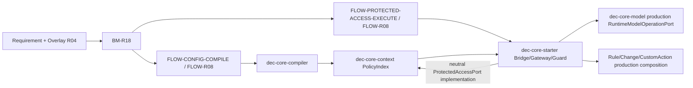

# 需求关联、影响策略与跨模块实现映射

- Project：`doc-eq-code`
- Version：`V_1.0`
- Revision：`BM-R18 / FLOW-R08 / DESIGN-P2-R20 / TESTDESIGN-P2-R21 / P2-IMPACT-R20`
- Status：`NEEDS_REVIEW / MACHINE_BLOCKED`
- Decisions：AC-007 `OPTION_B / ACTIVE`；AccessOperation `READ_WRITE_ONLY / ACTIVE`

## Authoritative revision direction

```text
REQAN-P2-R01 + Overlay R04
 -> BM-R18
 -> FLOW-R08
 -> DESIGN-P2-R20
 -> TESTDESIGN-P2-R21
```

## P2 relationship graph



## Source identity boundary

```text
authorization owner System + TargetKey(shared ViewKey) + exact ModelPath
  -> ModelAccessRuleKey + immutable PolicyIndex
local targetView/selector
  -> RuntimeBindingPlan only
```

`TargetKey` no longer invents a System-qualified source namespace; P1 shared source View identity is preserved.

## Runtime WRITE closure

```text
(ruleKey,target,path,frame,owner,cursor)
 -> 0 candidates: WRITE_INTENT_NOT_FOUND DENY
 -> 1 candidate : immutable freeze before Guard
 -> N candidates: WRITE_INTENT_AMBIGUOUS DENY
 -> capability atomic consume -> Guard -> dec-core-model exact mutation
```

## Production runtime boundary

`dec-core-model` is the planned production implementation of the neutral runtime model operation contract. Starter owns enforcement and assembly; a test fake cannot satisfy production reachability. P3/P4/P6 core continue to depend only on context neutral contracts and must not depend on starter.

## Gate

20 formal P1 findings remain OPEN. Current risk scan and same-revision independent Reviews are still absent; Implementation Plan/TDD/Development remain BLOCKED.
