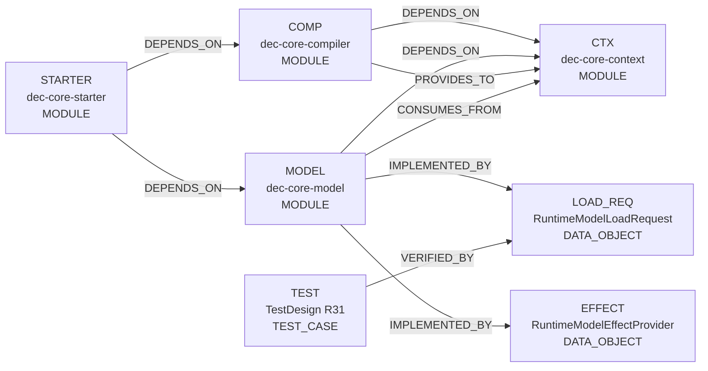
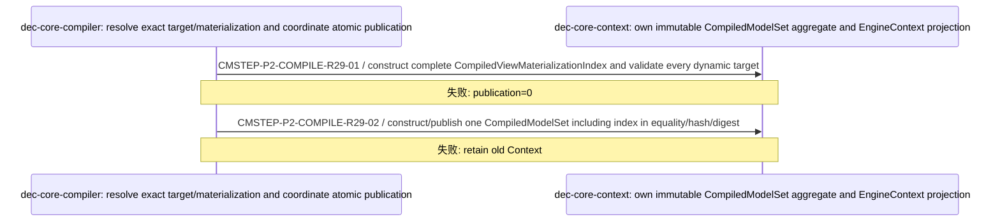
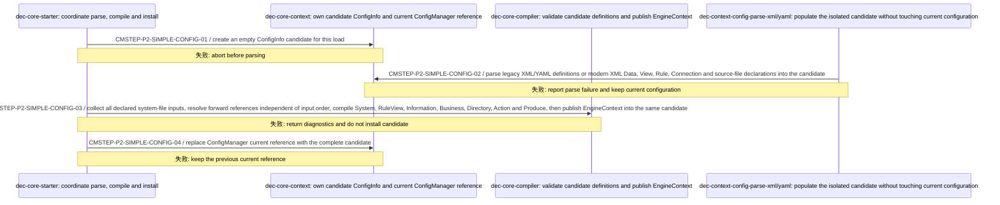
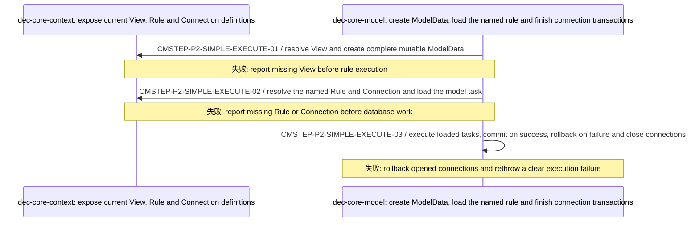

<!-- GENERATED by scripts/render_relationships.py; edit dependency_impact.yaml instead. -->
# 需求关联、影响策略与跨模块实现映射

- Project：`doc-eq-code`
- Version：`V_1.0`
- Revision：`P2-IMPACT-R30`

## 需求—需求关系图

- 本 revision 无适用关系。

## 需求—功能追踪图

- 本 revision 无适用关系。

## 功能—功能影响图



## 关系明细

| ID | From | 类型 | To | 条件 | 理由 | Trace IDs |
|---|---|---|---|---|---|---|
| REL-P2-R29-1 | COMP | DEPENDS_ON | CTX |  | Compiler publishes exact policy/binding plus typed materialization aggregate. | TR-P2-005<br>TR-P2-008 |
| REL-P2-R29-2 | MODEL | DEPENDS_ON | CTX |  | MODEL validates direct load requests only against captured immutable Context/materialization. | TR-P2-006 |
| REL-P2-R29-3 | MODEL | IMPLEMENTED_BY | LOAD_REQ |  | MODEL production lifecycle uses RuntimeModelLoadRequest as non-authoritative production input data. | TR-P2-006<br>TR-P2-009 |
| REL-P2-R29-4 | MODEL | IMPLEMENTED_BY | EFFECT |  | MODEL owns same-scope effect provider and actual operation port. | TR-P2-007<br>TR-P2-009 |
| REL-P2-R29-5 | STARTER | DEPENDS_ON | MODEL | FLOW-R11 protected access only | STARTER consumes trusted scope/effect provider; it does not own production model loading authority. | TR-P2-006<br>TR-P2-007 |
| REL-P2-R29-6 | TEST | VERIFIED_BY | LOAD_REQ |  | R31 proves exact direct-load validation, MODEL production boundary and same-ModelData identity. | TR-P2-006<br>TR-P2-009 |
| REL-P2-SIMPLE-001 | COMP | PROVIDES_TO | CTX | candidate validation has no ERROR | CompilerStarter publishes a valid EngineContext into the isolated ConfigInfo before ConfigManager installs the whole object. | TR-P2-002<br>TR-P2-003<br>TR-P2-004<br>TR-P2-009 |
| REL-P2-SIMPLE-002 | MODEL | CONSUMES_FROM | CTX | a complete ConfigInfo is installed | DataUtil, ModelLoader and ModelContainer resolve View, Rule and Connection through the current ConfigInfo. | TR-P2-005<br>TR-P2-006<br>TR-P2-010 |
| REL-P2-SIMPLE-003 | STARTER | DEPENDS_ON | COMP | XML or YAML parsing completed | Starter delegates candidate validation and EngineContext publication to compiler services. | TR-P2-002<br>TR-P2-003<br>TR-P2-004 |

## 关联对象处置策略

| ID | 来源动作 | 目标 | 策略 | 条件 | 一致性 | 失败/补偿 | Case |
|---|---|---|---|---|---|---|---|
| IMP-P2-CONTEXT-PUBLICATION-R29 | FLOW-CONFIG-COMPILE.publish exact policy/binding/materialization aggregate | COMP<br>CTX | REJECT_OPERATION | dynamic target lacks exactly one materialization descriptor<br>candidate aggregate/digest incomplete | ATOMIC | compile/publication ERROR; previous Context remains visible; 补偿: discard unpublished candidate | CASE-P2-TD-CONTEXT-MATERIALIZATION-INDEX-AGGREGATE-001<br>CASE-P2-TD-MATERIALIZATION-PUBLICATION-CLOSURE-001<br>CASE-P2-TD-ATOMIC-PUBLICATION-001 |
| IMP-P2-DIRECT-LOAD-R29 | FLOW-PROTECTED-ACCESS-EXECUTE.MODEL production lifecycle establishes trusted frame from RuntimeModelLoadRequest before FLOW STEP-01 | MODEL<br>CTX<br>LOAD_REQ | REJECT_OPERATION | root closed<br>plan absent from captured Context<br>materialization descriptor missing<br>origin not materializable<br>production Container load rejected | ATOMIC | stable RuntimeModelLoadFailure; no handle/scope reaches STARTER; 补偿: discard unexposed association | CASE-P2-TD-PRODUCTION-LOAD-REQUEST-001<br>CASE-P2-TD-PRODUCTION-LOAD-PLAN-MISMATCH-001<br>CASE-P2-TD-PRODUCTION-MODELDATA-IDENTITY-001<br>CASE-P2-TD-PRODUCTION-CONTAINER-TRUST-BOUNDARY-001 |
| IMP-P2-EFFECT-BINDING-R29 | FLOW-PROTECTED-ACCESS-EXECUTE.bind MODEL effect port to same sealed scope/session then execute only after Guard ALLOW | STARTER<br>MODEL<br>EFFECT | REJECT_OPERATION | scope/session mismatch<br>session unsealed/closed<br>resolved object not registered in bound session<br>Guard DENY<br>MODEL operation failure | ATOMIC | stable composition/operation denial; no unauthorized effect or success receipt; 补偿: close failed partial composition/session; no fallback provider | CASE-P2-TD-MODEL-EFFECT-PROVIDER-BINDING-001<br>CASE-P2-TD-MODEL-EFFECT-SAME-HANDLE-001<br>CASE-P2-TD-OPERATION-PORT-NOT-CALLER-INJECTABLE-001<br>CASE-P2-TD-RUNTIME-TARGET-SUBSTITUTION-001 |
| IMP-P2-SIMPLE-CONFIG-R30 | FLOW-CONFIG-COMPILE.parse candidate, compile EngineContext and install the complete ConfigInfo | COMP<br>CTX | REJECT_OPERATION | source is malformed<br>duplicate system-file or duplicate static definition is detected<br>a static reference cannot be resolved after all declared system-file inputs are collected<br>modern YAML declares System or Business Source Graph before P8 support is available<br>candidate validation reports ERROR<br>EngineContext publication fails | ATOMIC | discard the candidate and keep the previously installed ConfigInfo unchanged; 补偿: no business data compensation; previous configuration remains current | CASE-P2-R41-UNIFIED-LOAD-001<br>CASE-P2-R41-SOURCE-GRAPH-002<br>CASE-P2-R41-ATOMIC-COMPAT-003 |
| IMP-P2-SIMPLE-EXECUTE-R30 | FLOW-SIMPLE-MODEL-EXECUTE.create ModelData, load a named rule and execute ModelContainer | MODEL<br>CTX | REJECT_OPERATION | View is missing<br>Rule is missing<br>Connection is missing<br>database operation fails | ATOMIC | fail before the missing-definition side effect, or rollback opened connections on execution failure; 补偿: rollback participating connections and close all opened resources | CASE-P2-R41-SIMPLE-EXECUTE-004 |

# 跨模块实现映射

## CMI-P2-COMPILE-005 CompiledModelSet aggregate publication with typed materialization index

- 触发：FLOW-CONFIG-COMPILE



### 成功条件

- typed index aggregate-owned
- no runtime materialization repair
- atomic Context publication

### 失败与补偿

- `CMFAIL-P2-COMPILE-R29-01` @ `CMSTEP-P2-COMPILE-R29-01`：required descriptor absent/duplicate → compile ERROR; publication=0；补偿：无；人工恢复：fix configuration and submit fresh candidate

## CMI-P2-PROTECTED-ACCESS-009 Direct MODEL load request plus bound same-target effect under FLOW-R11

- 触发：FLOW-PROTECTED-ACCESS-EXECUTE

```mermaid
sequenceDiagram
  participant P_62728e19aa as dec-core-model: trusted production lifecycle forms request, validates captured Context, creates production Container/ModelData/Handle/Scope/Session/EffectProvider and owns actual effect
  participant P_a18454b6bf as dec-core-starter: consume trusted scope, register/seal, bind effect provider, resolve/capability/Guard and invoke bound effect only after ALLOW
  participant P_6ab313169e as dec-core-context: provide immutable binding/policy/materialization/result contracts
  P_62728e19aa->>P_62728e19aa: CMSTEP-P2-ACCESS-R29-00 / MODEL production lifecycle constructs RuntimeModelLoadRequest from exact selected plan + real origin + explicit routing; root validates captured Context, selects exact materialization, creates ModelData, uses existing 3-arg ModelLoader and MODEL-owned production Container, then freezes the same ModelData into trusted handle
  Note over P_62728e19aa,P_62728e19aa: 失败: load failure; handle/scope/STARTER/Guard/effect=0
  P_62728e19aa->>P_a18454b6bf: CMSTEP-P2-ACCESS-R29-01 / provide active MODEL-minted scope/frame; STARTER validates every handle plan/provenance against captured Context
  Note over P_62728e19aa,P_a18454b6bf: 失败: fail closed
  P_a18454b6bf->>P_62728e19aa: CMSTEP-P2-ACCESS-R29-02 / begin session, register exact frame handles, seal once, bind scope.effectProvider to that same sealed session, retain operation port privately
  Note over P_a18454b6bf,P_62728e19aa: 失败: stable session/effect code; capability/Guard/effect=0
  P_a18454b6bf->>P_62728e19aa: CMSTEP-P2-ACCESS-R29-03 / resolve exact plan to exactly one object registered in that sealed session
  Note over P_a18454b6bf,P_62728e19aa: 失败: NOT_FOUND/AMBIGUOUS/PROVENANCE_MISMATCH
  P_a18454b6bf->>P_a18454b6bf: CMSTEP-P2-ACCESS-R29-04 / freeze READ access or WRITE intent+stamp and one-shot capability for exact target/path/version
  Note over P_a18454b6bf,P_a18454b6bf: 失败: intent 0/N fails closed
  P_a18454b6bf->>P_6ab313169e: CMSTEP-P2-ACCESS-R29-05 / Guard exact ModelAccessRuleKey for frozen target/proof
  Note over P_a18454b6bf,P_6ab313169e: 失败: DENY; effect=0
  P_a18454b6bf->>P_62728e19aa: CMSTEP-P2-ACCESS-R29-06 / after ALLOW invoke private bound RuntimeModelOperationPort; recheck same sealed session/runtimeObjectId/registered handle before actual READ/WRITE
  Note over P_a18454b6bf,P_62728e19aa: 失败: scope/object/write mismatch fails closed; no fabricated success
```

### 成功条件

- RuntimeModelLoadRequest is data not permission authority
- plan validated against captured Context
- production Container MODEL-owned
- same created/loaded ModelData reaches Handle/Session/effect
- Guard precedes actual effect
- same STEP-03 object used at STEP-06
- business consumers have no MODEL load/effect bypass

### 失败与补偿

- `CMFAIL-P2-ACCESS-R29-01` @ `CMSTEP-P2-ACCESS-R29-00`：root closed/plan invalid/descriptor missing/origin incompatible/container load rejected → stable RuntimeModelLoadFailure; handle/scope/STARTER/Guard/effect=0；补偿：无；人工恢复：form a valid request in active MODEL production lifecycle
- `CMFAIL-P2-ACCESS-R29-02` @ `CMSTEP-P2-ACCESS-R29-02`：session/effect provider cannot bind same scope/session → no composition; capability/Guard/effect=0；补偿：close partial session；人工恢复：fresh active scope/session
- `CMFAIL-P2-ACCESS-R29-03` @ `CMSTEP-P2-ACCESS-R29-06`：resolved object/session mismatches bound effect or MODEL operation fails → stable denial/failure; no unauthorized success；补偿：无；人工恢复：fresh valid intent when allowed

## CMI-P2-SIMPLE-CONFIG-R30 ConfigInfo candidate compilation and installation

- 触发：FLOW-CONFIG-COMPILE



### 成功条件

- failed candidates never become current
- multiple system-file declarations are collected before duplicate and forward-reference validation
- modern XML publishes System, RuleView, Information, Business, Directory, Action and Produce as one compiled model
- legacy XML/YAML use the same isolated-candidate and whole-install semantics
- modern YAML with System or Business Source Graph is rejected before installation and explicitly deferred to P8
- ConfigInfo and EngineContext are observed as one installed object

### 失败与补偿

- `CMFAIL-P2-SIMPLE-CONFIG-00` @ `CMSTEP-P2-SIMPLE-CONFIG-02`：source is malformed or modern YAML declares a System or Business Source Graph → parsing fails with a source-aware error; P8 is named for unsupported modern YAML; current ConfigInfo is unchanged；补偿：discard the candidate；人工恢复：correct legacy syntax, use modern XML in P2, or complete YAML Source Graph support in P8
- `CMFAIL-P2-SIMPLE-CONFIG-01` @ `CMSTEP-P2-SIMPLE-CONFIG-03`：duplicate system-file, duplicate definition, unresolved reference, candidate validation or publication fails → diagnostics are returned and current ConfigInfo is unchanged；补偿：discard the candidate；人工恢复：correct the configuration source and load a new candidate

## CMI-P2-SIMPLE-EXECUTE-R30 Direct ModelContainer business execution

- 触发：FLOW-SIMPLE-MODEL-EXECUTE



### 成功条件

- business callers use DataUtil, ModelLoader and ModelContainer directly
- missing definitions fail before their corresponding side effect
- all opened connections are finished and closed

### 失败与补偿

- `CMFAIL-P2-SIMPLE-EXECUTE-01` @ `CMSTEP-P2-SIMPLE-EXECUTE-02`：Rule or Connection is missing → execution does not start and no database write occurs；补偿：无；人工恢复：install a configuration containing the named definition
- `CMFAIL-P2-SIMPLE-EXECUTE-02` @ `CMSTEP-P2-SIMPLE-EXECUTE-03`：model or database execution fails → participating connections are rolled back and closed；补偿：rollback opened connections, close opened connections；人工恢复：correct the business data or external database failure, then retry according to rule semantics
