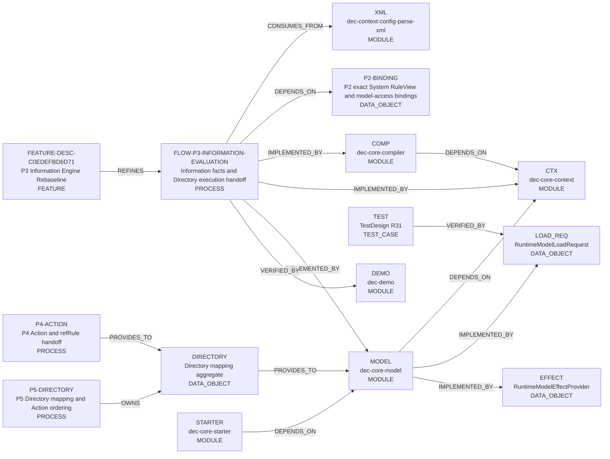
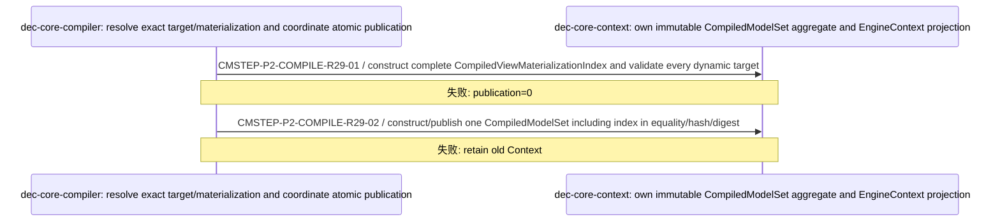

<!-- GENERATED by scripts/render_relationships.py; edit dependency_impact.yaml instead. -->
# 需求关联、影响策略与跨模块实现映射

- Project：`doc-eq-code`
- Version：`V_1.0`
- Revision：`P3-IMPACT-R02`

## 需求—需求关系图

- 本 revision 无适用关系。

## 需求—功能追踪图

- 本 revision 无适用关系。

## 功能—功能影响图



## 关系明细

| ID | From | 类型 | To | 条件 | 理由 | Trace IDs |
|---|---|---|---|---|---|---|
| REL-P2-R29-1 | COMP | DEPENDS_ON | CTX |  | Compiler publishes exact policy/binding plus typed materialization aggregate. | TR-P2-005<br>TR-P2-008 |
| REL-P2-R29-2 | MODEL | DEPENDS_ON | CTX |  | MODEL validates direct load requests only against captured immutable Context/materialization. | TR-P2-006 |
| REL-P2-R29-3 | MODEL | IMPLEMENTED_BY | LOAD_REQ |  | MODEL production lifecycle uses RuntimeModelLoadRequest as non-authoritative production input data. | TR-P2-006<br>TR-P2-009 |
| REL-P2-R29-4 | MODEL | IMPLEMENTED_BY | EFFECT |  | MODEL owns same-scope effect provider and actual operation port. | TR-P2-007<br>TR-P2-009 |
| REL-P2-R29-5 | STARTER | DEPENDS_ON | MODEL | FLOW-R11 protected access only | STARTER consumes trusted scope/effect provider; it does not own production model loading authority. | TR-P2-006<br>TR-P2-007 |
| REL-P2-R29-6 | TEST | VERIFIED_BY | LOAD_REQ |  | R31 proves exact direct-load validation, MODEL production boundary and same-ModelData identity. | TR-P2-006<br>TR-P2-009 |
| REL-P3-R02-TARGET-FLOW | FEATURE-DESC-C0EDEFBD6D71 | REFINES | FLOW-P3-INFORMATION-EVALUATION |  | The clean task owns the rebaselined P3 requirement while the stable Flow ID preserves business meaning. | TR-P3-INFORMATION-ENGINE-001 |
| REL-P3-R02-FLOW-XML | FLOW-P3-INFORMATION-EVALUATION | CONSUMES_FROM | XML |  | P3 compilation consumes Information, Directory and Action declaration facts parsed from XML. | TR-P3-INFORMATION-ENGINE-001 |
| REL-P3-R02-FLOW-P2 | FLOW-P3-INFORMATION-EVALUATION | DEPENDS_ON | P2-BINDING |  | P3 compilation requires published System, RuleView and exact model-access bindings from P2. | TR-P3-INFORMATION-ENGINE-001 |
| REL-P3-R02-FLOW-COMP | FLOW-P3-INFORMATION-EVALUATION | IMPLEMENTED_BY | COMP |  | Compiler validates and freezes Information, DAG and materialization target facts. | TR-P3-INFORMATION-ENGINE-001 |
| REL-P3-R02-FLOW-CTX | FLOW-P3-INFORMATION-EVALUATION | IMPLEMENTED_BY | CTX |  | Context publishes the compiled candidate and exposes the existing ConfigInfo lookup. | TR-P3-INFORMATION-ENGINE-001 |
| REL-P3-R02-FLOW-MODEL | FLOW-P3-INFORMATION-EVALUATION | IMPLEMENTED_BY | MODEL |  | MODEL owns read-only evaluation and ModelContainer execution and cleanup. | TR-P3-INFORMATION-ENGINE-001 |
| REL-P3-R02-P4-DIRECTORY | P4-ACTION | PROVIDES_TO | DIRECTORY |  | P4 provides Action and refRule facts consumed by Directory ordering. | TR-P3-INFORMATION-ENGINE-001 |
| REL-P3-R02-P5-DIRECTORY | P5-DIRECTORY | OWNS | DIRECTORY |  | P5 owns ChangeInfo and RuleViewInfo mapping plus ordered Action information. | TR-P3-INFORMATION-ENGINE-001 |
| REL-P3-R02-DIRECTORY-MODEL | DIRECTORY | PROVIDES_TO | MODEL |  | Directory provides ordered Action.refRule values; MODEL executes them in one ModelContainer. | TR-P3-INFORMATION-ENGINE-001 |
| REL-P3-R02-FLOW-DEMO | FLOW-P3-INFORMATION-EVALUATION | VERIFIED_BY | DEMO |  | The DEMO mix fixture supplies the declared 16-Information integration baseline. | TR-P3-INFORMATION-ENGINE-001 |

## 关联对象处置策略

| ID | 来源动作 | 目标 | 策略 | 条件 | 一致性 | 失败/补偿 | Case |
|---|---|---|---|---|---|---|---|
| IMP-P2-CONTEXT-PUBLICATION-R29 | FLOW-CONFIG-COMPILE.publish exact policy/binding/materialization aggregate | COMP<br>CTX | REJECT_OPERATION | dynamic target lacks exactly one materialization descriptor<br>candidate aggregate/digest incomplete | ATOMIC | compile/publication ERROR; previous Context remains visible; 补偿: discard unpublished candidate | CASE-P2-TD-CONTEXT-MATERIALIZATION-INDEX-AGGREGATE-001<br>CASE-P2-TD-MATERIALIZATION-PUBLICATION-CLOSURE-001<br>CASE-P2-TD-ATOMIC-PUBLICATION-001 |
| IMP-P2-DIRECT-LOAD-R29 | FLOW-PROTECTED-ACCESS-EXECUTE.MODEL production lifecycle establishes trusted frame from RuntimeModelLoadRequest before FLOW STEP-01 | MODEL<br>CTX<br>LOAD_REQ | REJECT_OPERATION | root closed<br>plan absent from captured Context<br>materialization descriptor missing<br>origin not materializable<br>production Container load rejected | ATOMIC | stable RuntimeModelLoadFailure; no handle/scope reaches STARTER; 补偿: discard unexposed association | CASE-P2-TD-PRODUCTION-LOAD-REQUEST-001<br>CASE-P2-TD-PRODUCTION-LOAD-PLAN-MISMATCH-001<br>CASE-P2-TD-PRODUCTION-MODELDATA-IDENTITY-001<br>CASE-P2-TD-PRODUCTION-CONTAINER-TRUST-BOUNDARY-001 |
| IMP-P2-EFFECT-BINDING-R29 | FLOW-PROTECTED-ACCESS-EXECUTE.bind MODEL effect port to same sealed scope/session then execute only after Guard ALLOW | STARTER<br>MODEL<br>EFFECT | REJECT_OPERATION | scope/session mismatch<br>session unsealed/closed<br>resolved object not registered in bound session<br>Guard DENY<br>MODEL operation failure | ATOMIC | stable composition/operation denial; no unauthorized effect or success receipt; 补偿: close failed partial composition/session; no fallback provider | CASE-P2-TD-MODEL-EFFECT-PROVIDER-BINDING-001<br>CASE-P2-TD-MODEL-EFFECT-SAME-HANDLE-001<br>CASE-P2-TD-OPERATION-PORT-NOT-CALLER-INJECTABLE-001<br>CASE-P2-TD-RUNTIME-TARGET-SUBSTITUTION-001 |
| IMP-P3-INFORMATION-001 | FLOW-P3-INFORMATION-EVALUATION.Compile Information and target facts; hand ordered Action.refRule values to the existing execution chain. | XML<br>COMP<br>CTX<br>MODEL<br>P2-BINDING<br>P4-ACTION<br>P5-DIRECTORY<br>DIRECTORY<br>DEMO | REJECT_OPERATION | Invalid Information or target facts<br>Invalid Directory mapping or rule reference<br>Loader or execution failure | ATOMIC | Reject invalid configuration before publication; on execution failure stop later loaders and preserve the original error through rollback/close/clear.; 补偿: Discard invalid candidates; reuse existing connection rollback. No external compensation is introduced. | CASE-P3-MIX-001<br>CASE-P3-ERROR-001<br>CASE-P3-CHANGE-INFO-001<br>CASE-P3-DIRECTORY-001 |

# 跨模块实现映射

## CMI-P2-COMPILE-005 CompiledModelSet aggregate publication with typed materialization index

- 触发：FLOW-CONFIG-COMPILE



### 成功条件

- typed index aggregate-owned
- no runtime materialization repair
- atomic Context publication

### 失败与补偿

- `CMFAIL-P2-COMPILE-R29-01` @ `CMSTEP-P2-COMPILE-R29-01`：required descriptor absent/duplicate → compile ERROR; publication=0；补偿：无；人工恢复：fix configuration and submit fresh candidate

## CMI-P2-PROTECTED-ACCESS-009 Direct MODEL load request plus bound same-target effect under FLOW-R11

- 触发：FLOW-PROTECTED-ACCESS-EXECUTE

```mermaid
sequenceDiagram
  participant P_62728e19aa as dec-core-model: trusted production lifecycle forms request, validates captured Context, creates production Container/ModelData/Handle/Scope/Session/EffectProvider and owns actual effect
  participant P_a18454b6bf as dec-core-starter: consume trusted scope, register/seal, bind effect provider, resolve/capability/Guard and invoke bound effect only after ALLOW
  participant P_6ab313169e as dec-core-context: provide immutable binding/policy/materialization/result contracts
  P_62728e19aa->>P_62728e19aa: CMSTEP-P2-ACCESS-R29-00 / MODEL production lifecycle constructs RuntimeModelLoadRequest from exact selected plan + real origin + explicit routing; root validates captured Context, selects exact materialization, creates ModelData, uses existing 3-arg ModelLoader and MODEL-owned production Container, then freezes the same ModelData into trusted handle
  Note over P_62728e19aa,P_62728e19aa: 失败: load failure; handle/scope/STARTER/Guard/effect=0
  P_62728e19aa->>P_a18454b6bf: CMSTEP-P2-ACCESS-R29-01 / provide active MODEL-minted scope/frame; STARTER validates every handle plan/provenance against captured Context
  Note over P_62728e19aa,P_a18454b6bf: 失败: fail closed
  P_a18454b6bf->>P_62728e19aa: CMSTEP-P2-ACCESS-R29-02 / begin session, register exact frame handles, seal once, bind scope.effectProvider to that same sealed session, retain operation port privately
  Note over P_a18454b6bf,P_62728e19aa: 失败: stable session/effect code; capability/Guard/effect=0
  P_a18454b6bf->>P_62728e19aa: CMSTEP-P2-ACCESS-R29-03 / resolve exact plan to exactly one object registered in that sealed session
  Note over P_a18454b6bf,P_62728e19aa: 失败: NOT_FOUND/AMBIGUOUS/PROVENANCE_MISMATCH
  P_a18454b6bf->>P_a18454b6bf: CMSTEP-P2-ACCESS-R29-04 / freeze READ access or WRITE intent+stamp and one-shot capability for exact target/path/version
  Note over P_a18454b6bf,P_a18454b6bf: 失败: intent 0/N fails closed
  P_a18454b6bf->>P_6ab313169e: CMSTEP-P2-ACCESS-R29-05 / Guard exact ModelAccessRuleKey for frozen target/proof
  Note over P_a18454b6bf,P_6ab313169e: 失败: DENY; effect=0
  P_a18454b6bf->>P_62728e19aa: CMSTEP-P2-ACCESS-R29-06 / after ALLOW invoke private bound RuntimeModelOperationPort; recheck same sealed session/runtimeObjectId/registered handle before actual READ/WRITE
  Note over P_a18454b6bf,P_62728e19aa: 失败: scope/object/write mismatch fails closed; no fabricated success
```

### 成功条件

- RuntimeModelLoadRequest is data not permission authority
- plan validated against captured Context
- production Container MODEL-owned
- same created/loaded ModelData reaches Handle/Session/effect
- Guard precedes actual effect
- same STEP-03 object used at STEP-06
- business consumers have no MODEL load/effect bypass

### 失败与补偿

- `CMFAIL-P2-ACCESS-R29-01` @ `CMSTEP-P2-ACCESS-R29-00`：root closed/plan invalid/descriptor missing/origin incompatible/container load rejected → stable RuntimeModelLoadFailure; handle/scope/STARTER/Guard/effect=0；补偿：无；人工恢复：form a valid request in active MODEL production lifecycle
- `CMFAIL-P2-ACCESS-R29-02` @ `CMSTEP-P2-ACCESS-R29-02`：session/effect provider cannot bind same scope/session → no composition; capability/Guard/effect=0；补偿：close partial session；人工恢复：fresh active scope/session
- `CMFAIL-P2-ACCESS-R29-03` @ `CMSTEP-P2-ACCESS-R29-06`：resolved object/session mismatches bound effect or MODEL operation fails → stable denial/failure; no unauthorized success；补偿：无；人工恢复：fresh valid intent when allowed

## CMI-P3-INFORMATION-001 P3 compilation and Directory to ModelContainer handoff

- 触发：Configuration compilation or explicit execution of a Directory's ordered Actions.

```mermaid
sequenceDiagram
  participant P_09e47c1d64 as XML: Parse XML declarations and preserve source and declaration order facts.
  participant P_588b6ac4ab as COMPILER: Validate and compile Information and materialization target facts.
  participant P_bd54fbb01b as CONTEXT: Publish the candidate and provide the existing ConfigInfo rule lookup.
  participant P_7f4f83c7cd as MODEL: Own ChangeInfo/RuleViewInfo mapping, invariant checks and ordered Action information.
  participant P_4633c8d24d as MODEL: Provide read-only Information evaluation and existing ModelLoader/ModelContainer execution and cleanup.
  participant P_8d69219b56 as COMPILER: Provide the published P2 System, RuleView and exact model-access binding prerequisite.
  participant P_7da6add6c1 as MODEL: Supply Action, system-ref, ref-rule and Produce facts at the downstream boundary.
  participant P_099e9ed469 as DEMO: Provide the mix fixture and integration evidence for the declared P3 behavior.
  P_09e47c1d64->>P_588b6ac4ab: CMSTEP-P3-COMPILE / Parse and validate the three Information kinds and eligible target facts against the existing P2 bindings.
  Note over P_09e47c1d64,P_588b6ac4ab: 失败: Reject invalid definitions and retain the previously published configuration.
  P_588b6ac4ab->>P_bd54fbb01b: CMSTEP-P3-PUBLISH / Publish validated Information and MaterializationTargetFact with the existing EngineContext/ConfigInfo boundary.
  Note over P_588b6ac4ab,P_bd54fbb01b: 失败: Keep the previously published context on failure.
  P_7f4f83c7cd->>P_4633c8d24d: CMSTEP-P3-EXECUTE / The caller loads each ordered Action.refRule into ModelLoader; the existing ConfigInfo lookup resolves the rule and one ModelContainer.execute handles all loaders.
  Note over P_7f4f83c7cd,P_4633c8d24d: 失败: Stop later loaders, roll back established connections, close and clear while retaining the primary exception and suppressed cleanup errors.
```

### 成功条件

- Ownership and references bind to clean task FEATURE-DESC-C0EDEFBD6D71 and FLOW-R10
- P3 publishes facts only
- Directory owns mappings and Action order
- ModelContainer owns execution and transactions

### 失败与补偿

- `CMFAIL-P3-COMPILE` @ `CMSTEP-P3-COMPILE`：Invalid definition or binding → Candidate rejected and prior configuration retained；补偿：Discard candidate；人工恢复：Correct configuration and recompile
- `CMFAIL-P3-EXECUTE` @ `CMSTEP-P3-EXECUTE`：Loader or rule execution fails → Stop subsequent execution and propagate the preserved failure；补偿：Rollback established connections, Close and clear；人工恢复：Diagnose the first failing refRule before retry
