# Final Code Review I014 integration / impact flow

Revision: `DEV-P2-R37-IMPLEMENTATION-R01@55c0269b69f5`

```mermaid
flowchart LR
  C[Compiler-published immutable EngineContext] --> F[ProtectedAccessRuntimeFactory]
  C --> R[RuntimeModelExecutionRoot]
  R --> S[MODEL RuntimeModelAccessScope]
  S --> SS[sealed RuntimeModelSession]
  SS --> B[RuntimeModelEffectBindingResult]
  B --> FB[STARTER-owned MODEL-package friend bridge]
  FB --> GP[GuardAuthorizedModelEffectPort]
  F --> PC[ProductionCompositionCoordinator]
  PC --> SS
  PC --> G[GuardedProtectedAccessPort]
  G --> XR[ExactModelAccessGuard]
  XR -->|DENY: no effect| D[ProtectedAccessDenial]
  XR -->|mint exact one-shot READ/WRITE auth| A[ModelEffectAuthorization]
  A --> GP
  GP -->|consume exactly once| M[MODEL guarded operation port]
  M -->|READ| RV[immutable RuntimeFactValue]
  M -->|WRITE under exact object/path MutationCell| E[Container effect]
  E -->|success| WR[receipt + monotonic version]
  E -->|failure| RB[rollback value; no receipt/version increment]

  H[config change] --> CL[close old composition/root/scope]
  CL --> NG[new runtime generation]
  NG --> NC[new compiler-published EngineContext]
```

## Owner / consistency / recovery map

| Step | Owner | Consistency boundary | Failure / recovery |
|---|---|---|---|
| Runtime Context capture | STARTER/MODEL runtime root | one immutable Context per generation | no in-place rebind; close + new generation |
| Scope/session lease | MODEL | synchronized exact Handle ownership | ownership conflict fails closed; close releases lease |
| Rule/target authorization | STARTER Guard | exact rule/target/frame/owner/cursor | denial before effect |
| WRITE coordination | STARTER + MODEL | exact session/object/path; one active writer + synchronized MutationCell | competing write denied; finally releases claim |
| MODEL effect | MODEL | value/version mutation transaction | effect failure restores previous value and does not increment version |
| Cross-module effect seam | STARTER-owned friend bridge | only GuardAuthorizedModelEffectPort | null/wrong/replayed auth denied before raw primitive |

No DB/schema migration, message broker, remote API, compensation workflow, or live hot-reload path is introduced by this remediation.
